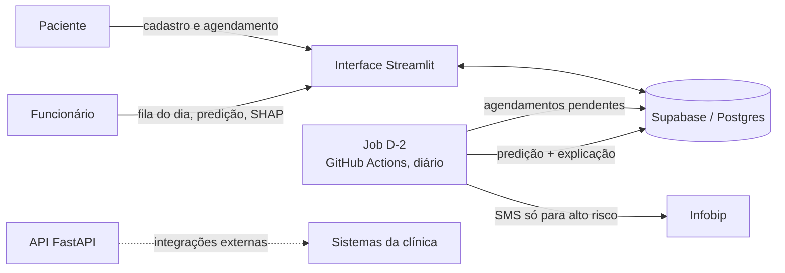
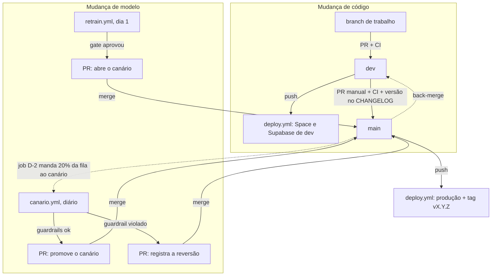

# SaudeJa — Classificador de no-show em agendamentos médicos

> Status: em desenvolvimento — (AI Factory: Build, Deploy and Showcase)

Prevê quais pacientes têm alta probabilidade de faltar a uma consulta e envia lembrete por SMS só para eles, dois dias antes do atendimento.

## Visão Geral

SaudeJá é um SaaS voltado para clínicas particulares de saúde de médio e pequeno porte que oferece serviço de agendamento online, prontuário, faturamento e comunicação com pacientes. Atualmente visa desenvolver uma funcionalidade para prevê pacientes que se ausenta de agendamentos médicos usando o classificador LightGBM. O repositório foi herdado com um pipeline de treinamento que resulta em um modelo com desempenho de Acurácia 78% no test set, F1-score para classe positiva de 0,65 e ROC-AUC de 0,81, dentro da disciplina AI Factory: Build, Deploy and Showcase.


## Problema

O no-show custa em média **R$ 180 por consulta perdida** e a taxa nacional gira em torno de 25-35%. Para uma clínica média (1.500 consultas/mês), isso significa R$ 70k-100k de receita evaporando todo mês. A primeira tentativa de reduzir o no-show foi de envio de lembrete para todos os pacientes, o que resultou em alto custo, sendo insustentável para clínicas com orçamento menor. A proposta atual é treinamento de um algoritmo que classifica os pacientes com alto chance de não comparecimento e apenas disparar lembrete para estes, reduzindo, dessa forma, em até 70% o gasto com mensageria.

## URL pública

| Ambiente | Endereço |
|---|---|
| Produção (Hugging Face Space) | _ainda não publicada — será adicionada após o primeiro deploy_ |

O Space publica só a interface Streamlit (porta 7860). A API FastAPI roda no mesmo container, mas não fica exposta publicamente. A visão **Paciente** é aberta; a visão **Funcionário** exige uma conta criada pelo administrador (ver [Criar conta de funcionário](#criar-conta-de-funcionário)).

## Arquitetura

Diagramas C4 (níveis 1 e 2) em [`docs/architecture.md`](docs/architecture.md). Decisões e alternativas descartadas em [`docs/adr/`](docs/adr/).

### Fluxo do produto



1. O paciente se cadastra e agenda a consulta pela interface. Os dados vão para o Supabase.
2. Todo dia às 08h17 (horário de São Paulo), o job D-2 busca os agendamentos dos próximos dois dias ainda sem predição, calcula a probabilidade de no-show e grava o resultado com a explicação SHAP.
3. Pacientes acima do threshold (`decision.threshold` em [`params.yaml`](params.yaml)) recebem SMS de confirmação via Infobip. Toda decisão, enviada ou não, fica registrada para auditoria.
4. O funcionário da clínica consulta a "Fila do dia", ordenada por risco, com a explicação de cada paciente.

### Componentes

| Componente | Onde está | Função |
|---|---|---|
| Interface | [`src/ui/`](src/ui/) | Streamlit com visão Paciente (autoagendamento) e Funcionário (login via Supabase Auth). A lógica fica em `logic.py`, testável sem o Streamlit |
| API de predição | [`src/api/`](src/api/) | FastAPI com `/health` e `/predict` (probabilidade + explicação SHAP) |
| Inferência | [`src/inference.py`](src/inference.py), [`src/explain.py`](src/explain.py) | Núcleo de predição e explicabilidade, compartilhado por interface, API e job |
| Contrato de features | [`src/contrato_features.py`](src/contrato_features.py) | Barra dado fora da regra de negócio (quarentena) e marca dado fora do domínio do treino |
| Job D-2 | [`src/jobs/inferencia_diaria.py`](src/jobs/inferencia_diaria.py) | Predição em lote e disparo de lembretes. Roda no GitHub Actions |
| Mensageria | [`src/messaging/`](src/messaging/) | `StubMessagingClient` (padrão, sem rede) ou `InfobipClient` (SMS real) |
| Banco | [`src/db/`](src/db/), [`supabase/migrations/`](supabase/migrations/) | Supabase na região `sa-east-1`. RLS habilitado; só o backend acessa, com a chave secreta |
| Observabilidade | [`src/observabilidade.py`](src/observabilidade.py), [`src/alerta_observabilidade.py`](src/alerta_observabilidade.py) | Latência, erros e execuções do job na tabela `eventos_app`, exibidos na aba "Observabilidade" e conferidos uma vez por dia pelo alerta |
| Pipeline de treino | [`dvc.yaml`](dvc.yaml), [`src/`](src/) | DVC + MLflow, cada stage em container Docker |

A interface chama o modelo **em processo**, sem passar pela API (`PREDICT_BACKEND=processo`, [ADR-005](docs/adr/adr-005-integracoes-implicitas.md)). Use `PREDICT_BACKEND=api` para exercitar a API a partir da interface.

### Pipeline de treino

Quatro stages no [`dvc.yaml`](dvc.yaml), cada um em container próprio a partir da imagem do [`dockerfile`](dockerfile):

| Stage | Script | O que faz |
|---|---|---|
| `validate_data` | `src/validate_data.py` | Barra o dataset antes do treino: schema, regra de negócio e taxa de positivos |
| `preprocess` | `src/preprocess.py` | Feature engineering e split treino/teste estratificado |
| `train` | `src/train.py` | SMOTE-NC só no fold de treino ([ADR-003](docs/adr/adr-003-SMOTE-NC.md)) e LightGBM. Registra a run no MLflow |
| `validate` | `src/validate.py` | Métricas no fold de teste isolado, logadas na mesma run do MLflow |

O dataset e o `data/model.pkl` são versionados pelo DVC num container privado do Azure Blob Storage. O histórico de métricas fica no MLflow; o do modelo em produção, em [`data/champion_metrics.json`](data/champion_metrics.json).

### CI/CD e ciclo de vida do modelo

| Workflow | Gatilho | Função |
|---|---|---|
| `ci.yml` | PR para `dev`/`main` | `ruff`, `mypy`, `pytest`, build e smoke da imagem de deploy, testes de integração; em PR para `main`, versão SemVer nova no CHANGELOG |
| `deploy.yml` | push em `dev` ou `main` | CI, verificação do modelo campeão, `supabase db push` e sync para o Space do ambiente; em `main`, cria a tag `vX.Y.Z` e a Release |
| `job_d2.yml` | diário, 08h17 | Job de inferência D-2 |
| `retrain.yml` | dia 1 de cada mês | Re-treino com gate de promoção; abre PR do modelo desafiante |
| `canario.yml` | diário, 09h47 | Avalia o modelo canário (20% da fila) e abre PR de promoção ou reversão ([ADR-009](docs/adr/adr-009-canario-do-modelo.md)) |
| `alerta_observabilidade.yml` | diário, 10h17 | Lê as últimas 24h de `eventos_app` e falha quando um limite do SLO é violado |
| `dependency-review.yml` | PR | Bloqueia dependência vulnerável |

Há dois ambientes, cada um com Space, projeto Supabase e secrets próprios no *environment* do GitHub: `dev`, alimentado pelo branch `dev`, e `production`, alimentado por `main`. Cada deploy de produção vira uma release SemVer a partir do topo do [CHANGELOG](docs/logs/CHANGELOG.md) ([ADR-010](docs/adr/adr-010-ambientes-e-releases.md)).

Só o modelo campeão vai para produção: deploy e job D-2 conferem o hash do `model.pkl` e o threshold contra `data/champion_metrics.json`. O deploy envia ao Space apenas o necessário para a imagem (código, `params.yaml` e modelo), nunca o dataset nem a configuração do DVC.

### Privacidade (LGPD)

Dados de saúde são tratados como reais desde o protótipo. CPF não é persistido (só o hash sha256), logs passam por filtro de redação de PII e há retenção automática dos dados derivados. Detalhes em [`docs/LGPD.md`](docs/LGPD.md); metas de serviço em [`docs/SLO.md`](docs/SLO.md) e [`docs/SLA.md`](docs/SLA.md).

## Como rodar

Os comandos abaixo usam PowerShell e partem da raiz do repositório.

### Pré-requisitos

- Python 3.10
- Docker com Docker Compose
- [Supabase CLI](https://supabase.com/docs/guides/cli) (banco local e testes de integração)
- Acesso ao remote do DVC (URL e connection string do Azure, fornecidas pela mantenedora)

### 1. Instalar

```powershell
git clone https://github.com/VL-in/ai-factory-saudeja.git
cd ai-factory-saudeja
python -m venv .venv
.venv\Scripts\Activate.ps1
pip install -r requirements/dev.txt
Copy-Item .env.example .env
```

`requirements/dev.txt` reúne todas as camadas (treino, API, interface, DVC, lint). As imagens Docker instalam só o que usam (`requirements/{train,api,ui}.txt`). Preencha o `.env` conforme os comentários de [`.env.example`](.env.example).

### 2. Baixar dataset e modelo (DVC)

A URL do remote não é versionada. Configure-a localmente e informe a credencial pelo ambiente:

```powershell
dvc remote add --local -f azure $env:DVC_REMOTE_URL
$env:AZURE_STORAGE_CONNECTION_STRING = "<connection string>"
dvc pull
```

| Erro | Causa |
|---|---|
| `azure is supported, but requires 'dvc-azure'` | `requirements/dvc.txt` não instalado no venv |
| remote `azure` não existe | faltou o `dvc remote add --local` |
| `requires either account_name or connection_string` | `AZURE_STORAGE_CONNECTION_STRING` não definida na sessão |
| `AuthorizationFailure` | o firewall da storage account não libera seu IP (*Networking → Firewalls and virtual networks → Add your client IP address*) |

### 3. Preparar o banco

Para desenvolver contra um banco local:

```powershell
supabase start    # sobe Postgres + Studio via Docker e aplica supabase/migrations/
supabase status   # mostra a URL e a chave secreta para o .env
```

Para usar o projeto na nuvem, coloque `SUPABASE_URL` e `SUPABASE_SECRET_KEY` (formato `sb_secret_...`, nunca a `publishable`) no `.env`. Ao criar uma migration, aplique nos dois bancos: `supabase db reset` (local) e `supabase db push` (remoto).

### 4. Subir a aplicação

Com Docker, do mesmo jeito que roda em produção:

```powershell
docker compose up -d app
```

| Endereço | Serviço |
|---|---|
| http://localhost:7860 | Interface Streamlit |
| http://localhost:8000/health | Status da API e versão do modelo |
| http://localhost:8000/docs | Documentação OpenAPI |

A imagem empacota o `data/model.pkl`: o build falha se o `dvc pull` não tiver rodado. Se o modelo mudar, rebuilde.

Sem Docker, em dois terminais:

```powershell
python -m uvicorn api.main:app --reload --app-dir src   # API
streamlit run src/ui/app.py                             # interface
```

Exemplo de predição:

```powershell
curl -X POST http://127.0.0.1:8000/predict -H "Content-Type: application/json" -d "{\"idade\":45,\"sexo\":\"F\",\"especialidade\":\"cardiologia\",\"distancia_km\":5.5,\"dias_entre_agendamento_consulta\":14,\"historico_noshow\":1,\"data_hora_agendada\":\"2026-01-09T18:00:00\"}"
```

Variáveis principais:

| Variável | Efeito |
|---|---|
| `APP_ENV` | `dev` exibe a aba "Dev: disparo manual", que executa o job D-2 pela interface. Use `prod` em produção |
| `PREDICT_BACKEND` | `processo` (padrão) ou `api` |
| `MESSAGING_PROVIDER` | `stub` (padrão, não envia nada) ou `infobip` (SMS real) |
| `TIMEZONE_CLINICA` | Fuso usado em datas e na fila do dia (padrão `America/Sao_Paulo`) |

### 5. Criar conta de funcionário

Não há cadastro aberto. O administrador cria cada conta no projeto Supabase para onde o `.env` aponta (a senha é digitada sem eco):

```powershell
python scripts/criar_funcionario.py recepcao@clinica.com.br
```

No projeto remoto, desligue "Allow new users to sign up" e defina "Minimum password length" como 8 em *Authentication → Sign In / Providers → Email*. O `supabase/config.toml` só vale para o banco local, e `supabase config push` sobrescreveria a configuração de produção com valores locais.

### 6. Treinar o modelo

```powershell
docker compose up -d mlflow-server   # MLflow em http://localhost:5000
dvc exp run                          # roda o pipeline como experimento
dvc exp show                         # compara experimentos
```

| Comando | Quando usar |
|---|---|
| `dvc exp run` | Testar variações (ex.: hiperparâmetros em `params.yaml`) sem alterar o `dvc.lock` |
| `dvc exp apply <exp>` | Trazer um experimento escolhido para o workspace |
| `dvc repro` | Consolidar uma mudança definitiva; atualiza `dvc.lock` e `data/model.pkl` |

Ao mudar o dataset, rode `dvc add data/<arquivo>` (nunca `dvc add .`). Faça commit do código junto com `dvc.lock` e o `.dvc` correspondente, e envie os artefatos com `dvc push`.

Em produção, o modelo não é trocado manualmente: o `retrain.yml` treina, compara com o campeão e abre um PR. A busca de hiperparâmetros (`src/tune.py`, GridSearchCV) é exploratória e fica fora do pipeline:

```powershell
docker compose run --rm -e MLFLOW_TRACKING_URI=http://mlflow-server:5000 train src/tune.py
```

### 7. Rodar o job D-2 manualmente

```powershell
python src/jobs/inferencia_diaria.py
```

O job recusa rodar se o `data/model.pkl` local não for o campeão. Com `MESSAGING_PROVIDER=stub`, nenhum SMS é enviado.

### 8. Testes e lint

```powershell
ruff check src tests scripts   # regras em ruff.toml
mypy src scripts               # configuração em mypy.ini
pytest                         # testes unitários
pytest -m integracao           # exige supabase start e Docker
```

O CI roda exatamente esses comandos. Para validar os workflows: `docker run --rm -v "${PWD}:/repo" -w /repo rhysd/actionlint:latest`.

## Fluxo de trabalho

Código e modelo chegam a produção por caminhos diferentes. Os dois terminam num merge em `main`, feito por uma pessoa.



### Mudança de código

1. Abra um branch a partir de `dev` e um PR para `dev`. O `ci.yml` roda lint, tipos, testes e o smoke da imagem.
2. O merge em `dev` dispara o `deploy.yml` para o ambiente de dev: migration no Supabase de dev e sync do Space de dev. Teste ali.
3. Para publicar, abra **você mesma** um PR `dev` → `main`. Nada abre esse PR automaticamente. Antes do merge, renomeie `## [Não publicado]` no [CHANGELOG](docs/logs/CHANGELOG.md) para a versão nova (`## [vX.Y.Z]`). O CI do PR confere a versão.
4. O merge em `main` dispara o deploy de produção. Com o Space no ar, o workflow cria a tag e a Release.

Mudanças só em `docs/**`, no `README.md` e nos arquivos do canário não disparam deploy.

### Mudança de modelo

O re-treino e o canário rodam a partir de `main` (o agendamento do GitHub só roda no branch padrão), e os PRs deles vão direto para `main`, sem passar por `dev`:

1. **Dia 1, `retrain.yml`.** Remonta o dataset com os desfechos registrados pela clínica, re-treina e compara com o campeão. Se o desafiante não regredir, publica o modelo no remote do DVC e abre o PR que o coloca como **canário**. O merge desse PR não redeploya o Space.
2. **Todo dia, `job_d2.yml` + `canario.yml`.** O job manda 20% da fila (sorteada por paciente) para o canário. A avaliação diária decide entre aguardar, promover ou reverter.
3. **Promoção.** PR que reescreve `data/champion_metrics.json`, sobe a versão PATCH e, no merge, dispara o deploy de produção.
4. **Reversão.** Age sozinha: o job do dia seguinte já manda 100% da fila ao campeão. O PR só formaliza a decisão e impede o gate de aprovar o mesmo modelo de novo.

Os PRs automáticos pedem revisão a `vars.REVISOR_PRS_MODELO` ou, sem ela, ao dono do repositório.

Depois de qualquer merge desses em `main`, traga `main` de volta para `dev` (`gh pr create --base dev --head main`). Sem isso, o próximo PR `dev` → `main` entra em conflito no CHANGELOG. O conflito se resolve mantendo as duas seções.

## Operação

### Onde o humano entra

| Quando | Quem | O que fazer | Se ninguém fizer |
|---|---|---|---|
| Todo dia, depois das consultas | Equipe da clínica | Registrar na "Fila do dia" quem compareceu e quem faltou | O re-treino não tem dado novo e falha (código 2). Esses desfechos são os rótulos do modelo |
| PR `dev` → `main` | Mantenedora | Revisar, subir a versão no CHANGELOG e fazer o merge | Nada vai para produção |
| PR do re-treino (canário) | Mantenedora | Conferir a tabela campeão × desafiante e a taxa de disparo projetada | O canário não entra |
| PR de promoção ou reversão do canário | Mantenedora | Conferir a evidência de produção e fazer o merge | Promoção: o modelo novo não vai ao ar. Nos dois casos, o próximo re-treino falha com código 4 enquanto houver canário em `main` |
| Workflow vermelho ou ping ausente no Healthchecks | Mantenedora | Ler o resumo do run (ver [Alertas](#alertas)) | O problema continua em silêncio |
| Depois de merge do robô em `main` | Mantenedora | Back-merge `main` → `dev` | Conflito no próximo PR de release |

A proteção de `main` (PR obrigatório e checks do CI) é o que torna o merge um ponto de controle. O *environment* `production` não tem revisor obrigatório, porque ele também pararia os jobs agendados ([ADR-010](docs/adr/adr-010-ambientes-e-releases.md)).

### Alertas

Toda falha de workflow manda e-mail pelo GitHub. Cada workflow agendado também pinga o próprio check no Healthchecks.io e manda `/fail` quando falha. Se o GitHub desativar os crons por inatividade do repositório, é a **ausência** do ping que avisa ([ADR-006](docs/adr/adr-006-observabilidade.md)).

| Workflow | Check do Healthchecks | O que significa a falha |
|---|---|---|
| `job_d2.yml` | `HEALTHCHECKS_JOB_D2_URL` | Pré ou pós-checagem do job: modelo que não é o campeão, contabilidade da fila divergente ou fila inteira em quarentena |
| `canario.yml` | `HEALTHCHECKS_CANARIO_URL` | A avaliação ou a abertura do PR falhou |
| `retrain.yml` | `HEALTHCHECKS_RETRAIN_URL` | Gate bloqueou (1), sem dado novo (2), pipeline falhou (3) ou canário em observação (4) |
| `alerta_observabilidade.yml` | `HEALTHCHECKS_ALERTA_URL` | Limite violado nas últimas 24h (erros, cobertura de explicação, latência) ou banco ilegível |

Os números do dia a dia ficam na aba "Observabilidade" da visão Funcionário. A disponibilidade do Space é medida de fora, pelo UptimeRobot em `/health`.

### Rollback

Escolha pelo que precisa voltar:

| O que voltar | Como | Age em | Precisa de PR? |
|---|---|---|---|
| Canário, na hora | variável `CANARIO_DESLIGADO=true` | próximo job D-2 | não (temporário) |
| Canário, de vez | `canario.yml` com `acao=reverter` | próximo job D-2 | sim, para registrar |
| Campeão já promovido | restaurar os ponteiros do campeão anterior | merge do PR | sim |
| Código ou interface | revert num branch a partir de `main` | merge do PR | sim |

#### Canário (modelo em observação, ainda não promovido)

1. **Desligar na hora.** Defina a variável no environment `production`. O job D-2 seguinte ignora `data/canario/` e manda 100% da fila ao campeão. O canário continua em `main`, e por isso o re-treino seguinte sai com código 4: use isto como freio enquanto decide, não como solução.

   ```powershell
   gh variable set CANARIO_DESLIGADO --env production --body "true"
   ```

2. **Reverter de vez.** Rode o `canario.yml` com um motivo. Ele grava a reversão no banco (vale já no job seguinte, com ou sem merge), registra o modelo em `data/canario_historico.json` para o gate nunca mais aprová-lo e abre o PR.

   ```powershell
   gh workflow run canario.yml -f acao=reverter -f motivo="taxa de disparo acima do esperado"
   ```

3. Faça o merge do PR de reversão. Se tiver usado o passo 1, volte a variável para vazio depois do merge (`gh variable set CANARIO_DESLIGADO --env production --body ""`).

#### Campeão (modelo já promovido)

Não há botão. Restaure, num PR para `main`, os três arquivos que apontam para o campeão anterior:

```powershell
git switch main; git pull
git switch -c rollback/modelo-anterior
# O commit que promoveu o modelo é o mais recente desta lista; o campeão
# anterior está no pai dele (<sha>^1).
git log --oneline --first-parent main -- data/champion_metrics.json
git checkout <sha>^1 -- data/champion_metrics.json dvc.lock data/consultas-treino.csv.dvc
python scripts/versao_release.py subir-patch --item "Rollback do modelo campeão para a versão anterior."
git add data/champion_metrics.json dvc.lock data/consultas-treino.csv.dvc docs/logs/CHANGELOG.md
git commit -m "(fix) data/champion_metrics.json, dvc.lock: rollback do modelo campeão"
git push -u origin rollback/modelo-anterior
gh pr create --base main
```

- O modelo antigo continua no remote do DVC, porque nenhuma credencial do Actions apaga blobs.
- O merge dispara o deploy, que confere o hash do modelo restaurado contra o `champion_metrics.json` antes de subir o Space. O job D-2 do dia seguinte já usa o modelo restaurado.
- O `champion_metrics.json` também guarda o threshold. Se `decision.threshold` em `params.yaml` mudou depois da promoção, restaure o valor antigo no mesmo PR, ou o deploy e o job D-2 recusam o modelo.
- Esse caminho não registra o modelo descartado em `data/canario_historico.json`, então o gate pode aprová-lo de novo num re-treino futuro.
- **Não use `git revert` do PR de promoção.** Ele apagaria a versão do CHANGELOG, e o deploy recusa uma versão que já tem tag. Na promoção de um canário, o revert também recriaria `data/canario/` e reativaria o modelo que acabou de ser tirado.

#### Código ou interface

1. Num branch a partir de `main`, reverta o commit (`git revert <sha>`, ou `git revert -m 1 <sha>` se for o merge de um PR).
2. Se o revert desfez a seção da versão no CHANGELOG, restaure o arquivo (`git checkout HEAD~1 -- docs/logs/CHANGELOG.md`) e acrescente uma versão PATCH nova: `python scripts/versao_release.py subir-patch --item "Rollback de ..."`.
3. Abra o PR para `main` e, depois do merge, faça o back-merge `main` → `dev`.

- **Migrations não voltam com o código.** O `supabase db push` só aplica migrations novas. Se a versão revertida trouxe uma migration aditiva (coluna ou tabela nova), o código antigo convive com ela. Se a migration foi destrutiva, o caminho é uma correção para frente, não um revert.
- O `workflow_dispatch` do `deploy.yml` não serve para voltar a uma tag antiga: fora de `main`, ele escolhe o environment `dev`. Em `main`, ele só reenvia o commit atual.

## Roadmap

- [x] Etapa 1: adoção do protótipo
- [x] Etapa 2: escolha da stack (ADR-001)
- [x] Etapa 3: arquitetura C4 + ADR-002 + repositório
- [ ] Etapa 4: deploy manual
- [ ] Etapa 5: CI/CD
- (etc.)

## Autor

Vanessa Hoysan Lin

## Licença

[MIT](LICENSE)
