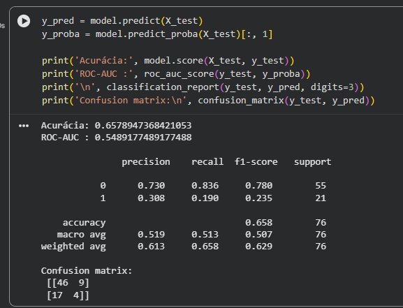
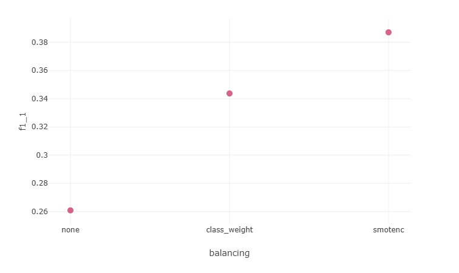
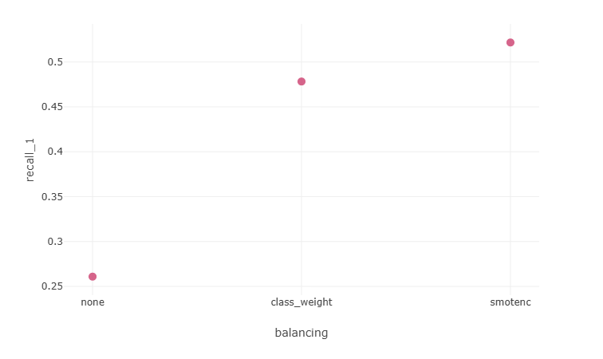
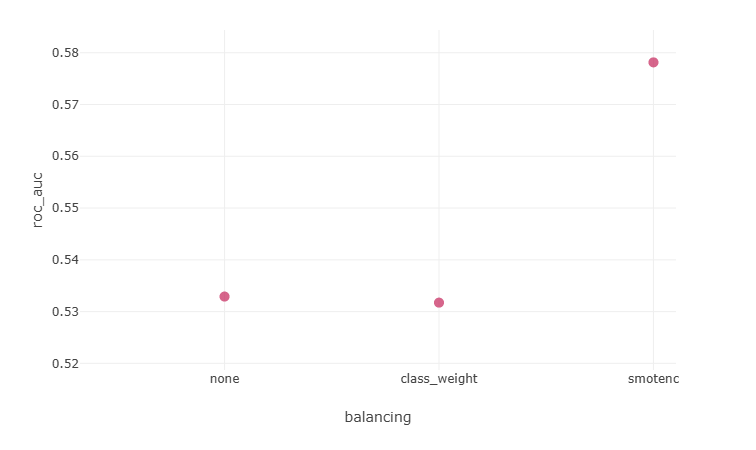

# ADR-003: Melhoria do F1 por meio de ____

## Status
Aceito - 2026-09-08

## Contexto
Melhoria da métrica F1 da classe positiva, que é a métrica de interesse do projeto. Atualmente, o modelo tem F1 = 0.65, e queremos melhorar isso. As proppostas de melhoria incluem comparação entre método SMOTE e balanceamento de classe (class_weight=balaced).
Um adendo importante:
Foi verificado que o projeto herdado possui, na verdade, possui F1 de 0.235 para a classe predita (no-show = 1), e não 0.61 como indica nas anotações da Camila.
Por precaução, foi baixado o dataset novamente do repo de origem, executando o notebook Jupyter em Google Colab para confirmar os valores.

Presseguiremos com a melhoria do F1 com as abordagens mencionadas. A condição "balanced=none" corresponde ao treinamento base herdado (igual ao descrito no notebook.ipynb da Camila).

## Decisão
A melhor método de melhoria do F1 da classe positiva foi por meio de SMOTE-NC.

### Metodologia:

Passo 1 — Criar params.yaml
Extrai os hiperparâmetros fixos do train.py e adiciona a nova dimensão que queremos comparar: a estratégia de balanceamento.

Passo 2 — Dependência nova
Adicionar imbalanced-learn em requirements.txt (é o pacote que traz SMOTENC), e copiar params.yaml para dentro da imagem em dockerfile.

Passo 3 — Declarar os params no dvc.yaml

Passo 4 — Ajustar train.py
Inclui os três caminhos de balanceamento (none/balancing=class_weight/balancing=smotenc)

Passo 5 — Rodar os três experimentos
Com dvc exp run, você sobrescreve o params.yaml só para aquela execução, sem tocar no Git:

- dvc exp run -S balancing.strategy=none            # baseline, sem tratamento
- dvc exp run -S balancing.strategy=class_weight
- dvc exp run -S balancing.strategy=smotenc -S balancing.k_neighbors=3

Passo 6 — Comparar os resultados
No terminal, via DVC (rápido, resume tudo numa tabela):

- dvc exp show --only-changed

Mostra params (balancing.strategy) e métricas (f1_1, pr_auc, recall_1...) das três execuções lado a lado.

No MLflow UI, para análise mais profunda (curvas, artefatos, comparação visual):

Acesse http://localhost:5000 diretamente no navegador; é o próprio servidor MLflow servindo a UI.

Filtre o experimento saudeja-no-show, selecione os 3 runs e use "Compare" — dá pra ver f1_1, pr_auc, recall_1 em gráfico de barras lado a lado, filtrando por params.balancing.

#### F1 da classe positiva nas três condições testadas

#### Recall da classe positiva nas três condições testadas

#### ROC_AUC nas três condições testadas

#### Todos as metricas avaliados para classe psoitiva (none/balanced/SMOTE-NC)

Experimentos gerados:

NONE (baseline): http://localhost:5000/#/experiments/1/runs/b392dfb413554472b88c7448c576b444

class_weight: http://localhost:5000/#/experiments/1/runs/4ebbb8db627b4695962ec5204bf10a09

smotenc : http://localhost:5000/#/experiments/1/runs/7be193263fa949e692b4baeef0f42cac

Passo 7 — Promover o vencedor
Depois de decidir (com base em f1_1 da classe positiva + pr_auc, priorizando o que faz mais sentido para o custo de negócio — falso negativo de no-show custa mais que falso positivo):

- dvc exp apply <nome-do-experimento-vencedor>
- git add params.yaml dvc.yaml dvc.lock requirements.txt dockerfile src/train.py
- git commit -m "..."

Isso materializa a escolha como um commit normal, e os outros experimentos ficam guardados no cache do DVC (recuperáveis com dvc exp show) sem terem sujado o histórico.

### Conclusão

O SMOTE-NC mostrou o melhor desempenho dentre as condições testadas, com F1_1 de 0.387 (comparado ao 0.261 do treinamento base) e recall de 0.522 (comparado a 0.261 do baseline).

## Consequências
    Pro:
    - F1_1 e recall_1 melhorado.

## Alternativas consideradas
O SMOTE clássico e as suas outras variações foram consideradas:
- Borderline-SMOTE/ADASYN: Fazem sentido quando o desbalanceamento é severo (ex. 95/5) e há muita sobreposição de classes. Aqui o desbalanceamento é moderado (73/27) — a agressividade extra tende a criar ruído artificial sem ganho real. Descartada.
- SMOTEN (só categóricas): não serve, porque a maioria das features aqui é numérica.
- K-Means SMOTE: agrupa antes de gerar sintéticos; com poucas dezenas de positivos por grupo, os clusters ficam instáveis e pouco confiáveis.
- SVMSMOTE: tende a instabilidade em amostras pequenas.