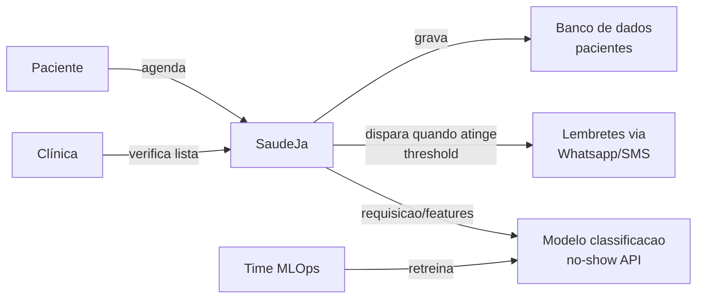
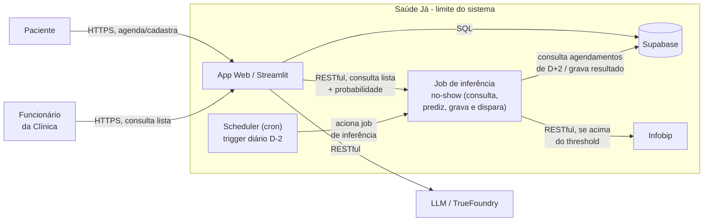

# Architecture Overview
This document serves as a critical, living template designed to equip agents with a rapid and comprehensive understanding of the codebase's architecture, enabling efficient navigation and effective contribution from day one. Update this document as the codebase evolves.

## 1. Project Structure

```
ai-factory-saudeja/
├── data/
│   ├── consultas-historicas.csv       # versionado via DVC (não versionado no git)
│   ├── consultas-historicas.csv.dvc   # metadados do DVC
│   ├── interim/                       # artefatos intermediários do pipeline (train_raw.pkl, test.pkl, mapa_especialidade.json, mlflow_run_id.txt)
│   ├── model.pkl                      # modelo treinado (saída do stage train)
│   ├── AVISO-DADOS-SINTETICOS.md
│   └── AVISO-MODELO.md
├── docs/
│   ├── BRIEFING.md
│   ├── SLA.md
│   ├── SLO.md
│   ├── adr/                           # Architecture Decision Records
│   ├── diagrams/
│   │   └── SaudeJa-c1.png
│   ├── herdado/                       # documentação do protótipo herdado
│   ├── logs/
│   │   └── CHANGELOG.md
│   └── architecture.md                # este arquivo
├── infra/
│   ├── api/                            # dockerfile da API FastAPI (Passo 3)
│   └── deploy/                         # dockerfile combinado Streamlit+FastAPI para o HF Space (Passo 11)
├── scripts/
│   └── gerar_timestamp_sintetico.py   # geração de timestamp sintético (exploratório)
├── src/
│   ├── preprocess.py                  # feature engineering + split treino/teste (stage 1)
│   ├── train.py                       # SMOTE-NC + treino LightGBM, loga no MLflow (stage 2)
│   ├── validate.py                    # métricas no fold de teste isolado (stage 3)
│   ├── tune.py                        # GridSearchCV de hiperparâmetros (exploratório, fora do dvc.yaml)
│   ├── features.py
│   ├── inference.py                   # payload -> features -> predição, reusado por API/job (Passo 1)
│   ├── explain.py                     # explicabilidade SHAP + plug LLM inativo (Passo 2)
│   ├── api/                           # API FastAPI: schemas.py + main.py (Passo 3)
│   └── notebook.ipynb
├── tests/                             # testes unitários e de integração do pipeline
├── .dvc/                              # configuração e cache do DVC
├── dvc.yaml / dvc.lock                # definição e lock do pipeline DVC
├── params.yaml                        # hiperparâmetros do modelo
├── dockerfile / dockerfile.mlflow     # imagens de treino e do servidor MLflow
├── docker-compose.yml                 # orquestração local (mlflow-server)
├── requirements/                      # base.txt / train.txt / api.txt (Passo 3)
├── .env.example
└── README.md
```

## 2. High-Level System Diagram

Camada C1

Camada C2


## 3. Core Components

### 3.1. Frontend

Name: App Web (Streamlit)

Description: Interface única para dois perfis de usuário — Paciente (cadastro/agendamento) e Funcionário da clínica (consulta da fila do dia com probabilidade de no-show, disparo manual do job de inferência em modo dev, consulta ao LLM sobre um paciente específico). Organizada em abas (`st.tabs`) que crescem incrementalmente conforme backend/banco/job ficam prontos (ver [`PLANO-IMPLEMENTACAO.md`](PLANO-IMPLEMENTACAO.md), Passo 4). Consome a API FastAPI (3.2.1) via `httpx`/`requests` e, opcionalmente, o LLM (5) para consultas livres.

Technologies: Python, Streamlit

Deployment: mesmo container do Hugging Face Space da API (ver 6), processo único, sem hospedagem separada.

### 3.2. Backend Services

#### 3.2.1. API de predição (FastAPI)

Name: API de predição de no-show

Description: Expõe `/predict` (recebe dados de um agendamento, retorna probabilidade de no-show + explicação SHAP) e `/health` (status + versão do modelo carregado). Carrega `data/model.pkl` uma vez no startup (`lifespan`), não por request, para atender o SLO de latência p95<2s. Serve tanto o Streamlit (chamado via REST para o formulário de teste/consulta) quanto integrações externas futuras ao ecossistema Saúde Já — ver decisão de acoplamento em [ADR-005](adr/adr-005-integracoes-implicitas.md).

Technologies: Python, FastAPI, LightGBM (via `src/inference.py`), SHAP

Deployment: Hugging Face Space (SDK Docker), junto com o Streamlit no mesmo container (ver 6).

#### 3.2.2. Job de inferência diária (D-2)

Name: Job de inferência no-show

Description: Executado diariamente (agendado externamente, ver ADR-005-a), busca no Supabase os agendamentos marcados para dois dias à frente, roda a predição+explicação (import direto de `src/inference.py`, mesmo módulo usado pela API), grava o resultado na tabela `predicoes` e aciona o disparo de mensageria (5) quando a probabilidade ultrapassa o threshold de `params.yaml`. Também exposto na aba "Dev: disparo manual" do Streamlit para acompanhamento sem depender de CLI/cron separados.

Technologies: Python (`src/jobs/inferencia_diaria.py`)

Deployment: roda como parte da imagem do HF Space, disparado por GitHub Actions cron (ver 6 e ADR-005-a) via `workflow_dispatch`/chamada HTTP ao Space.

#### 3.2.3. Gate de re-treino mensal

Name: Gate de promoção de modelo

Description: Re-treina o pipeline DVC/MLflow contra dados frescos, compara métricas (`recall_1`, `f1_1`, `roc_auc`) contra o campeão atual (`data/champion_metrics.json`, versionado em git) e só promove `data/model.pkl` se não houver regressão além da tolerância do SLO. Bloqueia promoção e alerta a equipe via mensageria (5) em caso de regressão. Ver detalhamento no [`PLANO-IMPLEMENTACAO.md`](PLANO-IMPLEMENTACAO.md), Passo 9.

Technologies: Python (`src/retrain_gate.py`), DVC, MLflow (efêmero via `docker-compose`, só durante o workflow)

Deployment: GitHub Actions (cron mensal + `workflow_dispatch`), sem infraestrutura própria always-on.

## 4. Data Stores

### 4.1. Banco relacional principal

Name: Supabase (decisão vigente: [ADR-004](adr/adr-004-decisão-técnica.md), via SDK `supabase-py`)

Type: PostgreSQL gerenciado (SDK oficial, não camada Postgres genérica)

Purpose: armazena pacientes, agendamentos e resultado das predições/mensagens, com minimização de PII por design — `pacientes` guarda só `id_paciente_externo` (referência ao sistema core da clínica) + atributos demográficos não identificáveis, nunca nome/CPF (ver [`PLANO-IMPLEMENTACAO.md`](PLANO-IMPLEMENTACAO.md), Passo 5, e [ADR-005-c](adr/adr-005-integracoes-implicitas.md) para a checagem de região LGPD).

Key Schemas/Collections: `pacientes`, `agendamentos`, `predicoes` (inclui `explicacao_shap jsonb` e `explicacao_texto` nullable — plug do LLM, Passo 13), `mensagens_disparadas` (auditoria de envio, SLA §6).

### 4.2. Tracking de experimentos de ML

Name: MLflow (backend sqlite + artifacts em volumes Docker locais)

Type: tracking server efêmero (sobe via `docker-compose` só durante treino/validação/gate de re-treino)

Purpose: rastreabilidade de hiperparâmetros/métricas/modelo de cada run de treino (ver README, seção "Pipeline de treino"). A fonte de verdade do "modelo campeão" para produção é `data/champion_metrics.json` (versionado em git), não uma run do MLflow — que não sobrevive entre execuções do workflow mensal (ver Passo 9).

## 5. External Integrations / APIs

Service Name: Infobip

Purpose: disparo de lembrete/confirmação via WhatsApp/SMS para pacientes classificados com alta probabilidade de no-show pelo job diário (D-2).

Integration Method: REST API, atrás de uma interface própria (`src/messaging/client.py`) com stub sem custo para dev/test e implementação real ativada por variável de ambiente (Passo 7).

Service Name: TrueFoundry (LLM gateway)

Purpose: opcional (Passo 13, não exigido pelo SLA/SLO) — permite ao funcionário consultar um paciente específico em linguagem natural, e futuramente traduzir as contribuições SHAP em uma frase explicativa (plug inativo já reservado no Passo 2).

Integration Method: REST API, mesmo padrão interface+stub usado para a Infobip.

Service Name: MLflow

Purpose: ver 4.2.

Integration Method: API Python do MLflow, servidor local via Docker Compose.

## 6. Deployment & Infrastructure

Cloud Provider: Hugging Face Space (SDK Docker) para a aplicação; Supabase (gerenciado) para o banco.

Key Services Used: Hugging Face Space (Streamlit + FastAPI no mesmo container, modelo `data/model.pkl` versionado via DVC e empacotado direto na imagem — não depende de MLflow ao vivo em produção, ver Passo 9); GitHub Actions (CI de PR, deploy por sync ao HF Hub via `huggingface/huggingface-sync-action`, cron mensal do gate de re-treino, cron diário do job D-2 — ver [ADR-005-a](adr/adr-005-integracoes-implicitas.md)).

CI/CD Pipeline: GitHub Actions — `ci.yml` (lint + pytest em PRs) e `deploy.yml` (sync `main` → HF Space, só após `ci.yml` passar). Ver Passo 10.

Monitoring & Logging: MLflow para métricas de ML (4.2); logging estruturado JSON com redação de PII (`src/logging_config.py`, Passo 8) para a aplicação. Sem Langfuse/APM dedicado no núcleo — reservado para tracing do LLM opcional (Passo 13).

## 7. Security Considerations

Authentication: chaves de serviço do Supabase (`SUPABASE_URL`/`SUPABASE_KEY`) e token do HF Space (`HF_TOKEN`) como secrets, nunca versionados (`.env.example` documenta as variáveis, não os valores).

Authorization: não há multiusuário/RBAC no núcleo do produto — dois perfis de UI (Paciente/Funcionário) sem autenticação forte ainda desenhada; fica como debt conhecido (ver §9).

Data Encryption: TLS em trânsito (HTTPS do HF Space, conexão do `supabase-py` ao Postgres gerenciado); repouso sob responsabilidade do Supabase gerenciado.

Key Security Tools/Practices: minimização de PII por design no schema (4.1), redação de PII em log (`src/logging_config.py`), auditoria de LGPD via `scripts/auditoria_lgpd.py` — ver [`docs/LGPD.md`](LGPD.md) (criado no Passo 8) para base legal, retenção e contato DPO.

## 8. Development & Testing Environment

Local Setup Instructions: ver [`README.md`](../README.md), seção "Como usar o repositório" (Docker + DVC + MLflow local via `docker compose up -d mlflow-server` e `dvc exp run`/`dvc repro`).

Testing Frameworks: Pytest (`pytest.ini` define o marcador `integracao` para testes que sobem serviços reais efêmeros — MLflow com sqlite temporário, futuramente Supabase CLI local no Passo 5 — em vez de mocks pesados).

Code Quality Tools: `ruff` (a ser formalizado em `requirements.txt`/config no Passo 10, junto do CI).

## 9. Future Considerations / Roadmap

**Debt conhecido — gap de recall**: o recall atual da classe positiva (no-show) é 0.522 (ver [ADR-003](adr/adr-003-SMOTE-NC.md)), abaixo do alvo do SLO (≥0.75). Não é um bug de implementação — é limite do dataset sintético pequeno (380 linhas). Não será resolvido agora; o [`PLANO-IMPLEMENTACAO.md`](PLANO-IMPLEMENTACAO.md) cria checkpoints explícitos para revisitar a questão (Passo 6, com dados fluindo pelo job real; Passo 12, fechamento obrigatório antes do pitch — threshold recalibrado ou gap aceito e documentado).

Outros itens de roadmap: autenticação/RBAC para os dois perfis de usuário (não desenhada ainda); LLM/TrueFoundry (Passo 13, opcional, fora do SLA/SLO); Langfuse para tracing do LLM quando este for ativado.

## 10. Project Identification

Project Name: SaudeJá — Classificador de no-show em agendamentos médicos

Repository URL: (repositório local/privado da disciplina AI Factory: Build, Deploy and Showcase — sem URL pública no momento)

Primary Contact/Team: Vanessa Hoysan Lin

Date of Last Update: 2026-09-18

## 11. Glossary / Acronyms

No-show: ausência do paciente a uma consulta agendada sem cancelamento prévio.

D-2 / D+2: dois dias antes da data da consulta — momento em que o job de inferência roda a predição para os agendamentos daquele intervalo.

SMOTE-NC: técnica de balanceamento de classes (SMOTE) adaptada para lidar com variáveis categóricas e numéricas mistas (Nominal-Continuous).

SLA/SLO: Service Level Agreement / Service Level Objective — ver [`docs/SLA.md`](SLA.md) e [`docs/SLO.md`](SLO.md).

ADR: Architecture Decision Record — ver [`docs/adr/`](adr/).

LGPD: Lei Geral de Proteção de Dados (Brasil) — ver [`docs/LGPD.md`](LGPD.md), a ser criado no Passo 8 do plano de implementação.
