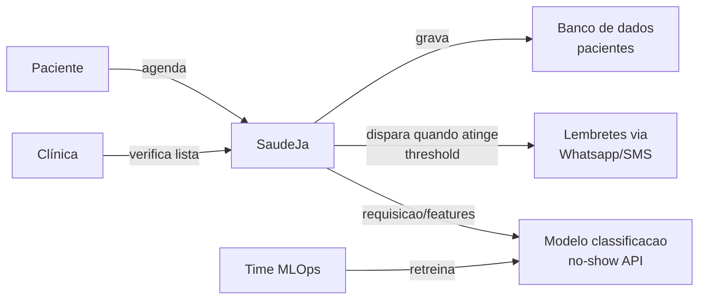
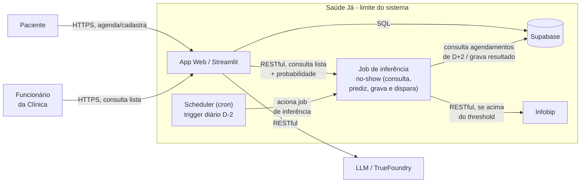

# Architecture Overview
This document serves as a critical, living template designed to equip agents with a rapid and comprehensive understanding of the codebase's architecture, enabling efficient navigation and effective contribution from day one. Update this document as the codebase evolves.

## 1. Project Structure

```
ai-factory-saudeja/
├── data/
│   ├── consultas-historicas.csv       # versionado via DVC (não versionado no git)
│   ├── consultas-historicas.csv.dvc   # metadados do DVC
│   ├── interim/                       # artefatos intermediários do pipeline (train_raw.pkl, test.pkl, mapa_especialidade.json, mlflow_run_id.txt)
│   ├── model.pkl                      # modelo treinado (saída do stage train)
│   ├── AVISO-DADOS-SINTETICOS.md
│   └── AVISO-MODELO.md
├── docs/
│   ├── BRIEFING.md
│   ├── SLA.md
│   ├── SLO.md
│   ├── adr/                           # Architecture Decision Records
│   ├── diagrams/
│   │   └── SaudeJa-c1.png
│   ├── herdado/                       # documentação do protótipo herdado
│   ├── logs/
│   │   └── CHANGELOG.md
│   └── architecture.md                # este arquivo
├── infra/
│   ├── ML/
│   │   └── dockerfile                 # imagem do container do modelo
│   └── deploy/
├── scripts/
│   └── gerar_timestamp_sintetico.py   # geração de timestamp sintético (exploratório)
├── src/
│   ├── preprocess.py                  # feature engineering + split treino/teste (stage 1)
│   ├── train.py                       # SMOTE-NC + treino LightGBM, loga no MLflow (stage 2)
│   ├── validate.py                    # métricas no fold de teste isolado (stage 3)
│   ├── tune.py                        # GridSearchCV de hiperparâmetros (exploratório, fora do dvc.yaml)
│   ├── features.py
│   └── notebook.ipynb
├── tests/                             # testes unitários e de integração do pipeline
├── .dvc/                              # configuração e cache do DVC
├── dvc.yaml / dvc.lock                # definição e lock do pipeline DVC
├── params.yaml                        # hiperparâmetros do modelo
├── dockerfile / dockerfile.mlflow     # imagens de treino e do servidor MLflow
├── docker-compose.yml                 # orquestração local (mlflow-server)
├── requirements.txt
├── .env.example
└── README.md
```

## 2. High-Level System Diagram

Camada C1

Camada C2


## 3. Core Components
(List and briefly describe the main components of the system. For each, include its primary responsibility and key technologies used.)

### 3.1. Frontend

Name: [e.g., Web App, Mobile App]

Description: Briefly describe its primary purpose, key functionalities, and how users or other systems interact with it. E.g., 'The main user interface for interacting with the system, allowing users to manage their profiles, view data dashboards, and initiate workflows.'

Technologies: [e.g., React, Next.js, Vue.js, Swift/Kotlin, HTML/CSS/JS]

Deployment: [e.g., Vercel, Netlify, S3/CloudFront]

### 3.2. Backend Services

(Repeat for each significant backend service. Add more as needed.)

#### 3.2.1. [Service Name 1]

Name: [e.g., User Management Service, Data Processing API]

Description: [Briefly describe its purpose, e.g., "Handles user authentication and profile management."]

Technologies: [e.g., Node.js (Express), Python (Django/Flask), Java (Spring Boot), Go]

Deployment: [e.g., AWS EC2, Kubernetes, Serverless (Lambda/Cloud Functions)]

#### 3.2.2. [Service Name 2]

Name: [e.g., Analytics Service, Notification Service]

Description: [Briefly describe its purpose.]

Technologies: [e.g., Python, Kafka, Redis]

Deployment: [e.g., AWS ECS, Google Cloud Run]

## 4. Data Stores

(List and describe the databases and other persistent storage solutions used.)

### 4.1. [Data Store Type 1]

Name: [e.g., Primary User Database, Analytics Data Warehouse]

Type: [e.g., PostgreSQL, MongoDB, Redis, S3, Firestore]

Purpose: [Briefly describe what data it stores and why.]

Key Schemas/Collections: [List important tables/collections, e.g., users, products, orders (no need for full schema, just names)]

### 4.2. [Data Store Type 2]

Name: [e.g., Cache, Message Queue]

Type: [e.g., Redis, Kafka, RabbitMQ]

Purpose: [Briefly describe its purpose, e.g., "Used for caching frequently accessed data" or "Inter-service communication."]

## 5. External Integrations / APIs

(List any third-party services or external APIs the system interacts with.)

Service Name 1: [e.g., Stripe, SendGrid, Google Maps API]

Purpose: [Briefly describe its function, e.g., "Payment processing."]

Integration Method: [e.g., REST API, SDK]

## 6. Deployment & Infrastructure

Cloud Provider: [e.g., AWS, GCP, Azure, On-premise]

Key Services Used: [e.g., EC2, Lambda, S3, RDS, Kubernetes, Cloud Functions, App Engine]

CI/CD Pipeline: [e.g., GitHub Actions, GitLab CI, Jenkins, CircleCI]

Monitoring & Logging: [e.g., Prometheus, Grafana, CloudWatch, Stackdriver, ELK Stack]

## 7. Security Considerations

(Highlight any critical security aspects, authentication mechanisms, or data encryption practices.)

Authentication: [e.g., OAuth2, JWT, API Keys]

Authorization: [e.g., RBAC, ACLs]

Data Encryption: [e.g., TLS in transit, AES-256 at rest]

Key Security Tools/Practices: [e.g., WAF, regular security audits]

## 8. Development & Testing Environment

Local Setup Instructions: [Link to CONTRIBUTING.md or brief steps]

Testing Frameworks: [e.g., Jest, Pytest, JUnit]

Code Quality Tools: [e.g., ESLint, Black, SonarQube]

## 9. Future Considerations / Roadmap

(Briefly note any known architectural debts, planned major changes, or significant future features that might impact the architecture.)

[e.g., "Migrate from monolith to microservices."]

[e.g., "Implement event-driven architecture for real-time updates."]

## 10. Project Identification

Project Name: [Insert Project Name]

Repository URL: [Insert Repository URL]

Primary Contact/Team: [Insert Lead Developer/Team Name]

Date of Last Update: [YYYY-MM-DD]

## 11. Glossary / Acronyms

Define any project-specific terms or acronyms.)

[Acronym]: [Full Definition]

[Term]: [Explanation]
