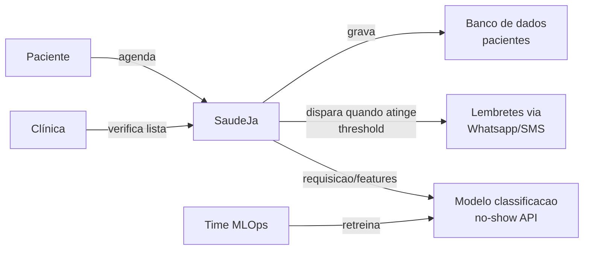
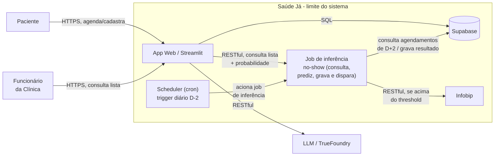

# Architecture Overview
This document serves as a critical, living template designed to equip agents with a rapid and comprehensive understanding of the codebase's architecture, enabling efficient navigation and effective contribution from day one. Update this document as the codebase evolves.

## 1. Project Structure

```
ai-factory-saudeja/
├── data/
│   ├── consultas-historicas.csv       # versionado via DVC (não versionado no git)
│   ├── consultas-historicas.csv.dvc   # metadados do DVC
│   ├── interim/                       # artefatos intermediários do pipeline (train_raw.pkl, test.pkl, mapa_especialidade.json, mlflow_run_id.txt)
│   ├── model.pkl                      # modelo treinado (saída do stage train)
│   ├── consultas-treino.csv           # semente + desfechos reais de produção (Passo 9.0, via DVC)
│   ├── champion_metrics.json          # métricas do modelo em produção (versionado em git, Passo 9.1)
│   ├── AVISO-DADOS-SINTETICOS.md
│   └── AVISO-MODELO.md
├── docs/
│   ├── BRIEFING.md
│   ├── LGPD.md                        # base legal, retenção, direitos, riscos residuais (Passo 8)
│   ├── PLANO-IMPLEMENTACAO.md
│   ├── SLA.md
│   ├── SLO.md
│   ├── adr/                           # Architecture Decision Records
│   ├── diagrams/
│   │   └── SaudeJa-c1.png
│   ├── herdado/                       # documentação do protótipo herdado
│   ├── logs/
│   │   └── CHANGELOG.md
│   └── architecture.md                # este arquivo
├── infra/
│   ├── api/                            # dockerfile da API FastAPI isolada (Passo 3)
│   └── deploy/                         # dockerfile + entrypoint.sh combinados Streamlit+FastAPI (Passo 11, antecipado no Passo 4)
├── scripts/
│   ├── auditoria_lgpd.py              # varredura de PII em log (Passo 8, ferramenta local)
│   └── gerar_timestamp_sintetico.py   # geração de timestamp sintético (exploratório)
├── supabase/
│   ├── config.toml                    # config do Supabase CLI (supabase start, região local)
│   └── migrations/                    # schema versionado (pacientes/agendamentos/predicoes/mensagens_disparadas, Passo 5; índice de agendamentos.id_paciente, Passo 6; eventos_app, Passo 8.5)
├── src/
│   ├── config_projeto.py              # REPO_ROOT + carregar_params(): caminhos independentes do CWD
│   ├── logging_config.py              # log estruturado JSON + redação de PII (Passo 8)
│   ├── agenda_clinica.py              # grade de horários da clínica (cadastro do paciente, Passo 5)
│   ├── db/                            # client.py (supabase-py) + repositories.py (Passo 5)
│   ├── export_treino.py               # desfechos reais do Supabase -> consultas-treino.csv (Passo 9.0)
│   ├── retrain_gate.py                # gate de promoção do re-treino mensal (Passo 9.1)
│   ├── preprocess.py                  # feature engineering + split treino/teste (stage 1)
│   ├── train.py                       # SMOTE-NC + treino LightGBM, loga no MLflow (stage 2)
│   ├── validate.py                    # métricas no fold de teste isolado (stage 3)
│   ├── tune.py                        # GridSearchCV de hiperparâmetros (exploratório, fora do dvc.yaml)
│   ├── features.py
│   ├── inference.py                   # payload -> features -> predição, reusado por API/job (Passo 1)
│   ├── explain.py                     # explicabilidade SHAP + plug LLM inativo (Passo 2)
│   ├── api/                           # API FastAPI: schemas.py + main.py (Passo 3)
│   ├── ui/                            # interface Streamlit: app.py (telas) + logic.py (lógica testável) (Passo 4)
│   ├── jobs/                          # inferencia_diaria.py: job D-2 (Passo 6)
│   └── messaging/                     # client.py: interface + stub + InfobipClient (SMS real, Passo 7)
├── tests/                             # testes unitários e de integração do pipeline
├── .github/workflows/                 # retrain.yml (cron mensal do gate, Passo 9.1); ci.yml/deploy.yml/job_d2.yml no Passo 10
├── .dvc/                              # configuração e cache do DVC (config versionado só com `core.remote`; URL/credencial fora do git)
├── dvc.yaml / dvc.lock                # definição e lock do pipeline DVC
├── params.yaml                        # hiperparâmetros do modelo
├── dockerfile / dockerfile.mlflow     # imagens de treino e do servidor MLflow
├── docker-compose.yml                 # orquestração local (mlflow-server)
├── requirements/                      # base.txt / train.txt / api.txt / dev.txt
├── pytest.ini                         # marcador `integracao`
├── ruff.toml                          # configuração do lint
├── .dockerignore / .gitattributes  # contexto de build enxuto; LF nos .sh mesmo no Windows
├── .env.example
└── README.md
```

## 2. High-Level System Diagram

Camada C1

```mermaid
flowchart LR
    UserP[Paciente] -->|agenda| Sys[SaudeJa]
    UserC[Clínica] -->|verifica lista| Sys[SaudeJa]
    Sys --> |grava| DB[Banco de dados<br/> pacientes]
    Sys --> |dispara quando atinge<br/>threshold| Aut[Lembretes via<br/> Whatsapp/SMS]
    Sys --> |requisicao/features| ML[Modelo classificacao<br/>no-show API]
    Admin[Time MLOps] -->|retreina| ML
```
Camada C2

```mermaid
flowchart LR
    Paciente["Paciente"]
    Funcionario["Funcionário<br/>da Clínica"]
    LLM["LLM / TrueFoundry"]

    subgraph SaudeJa["Saúde Já - limite do sistema"]
        direction TB
        web["App Web / Streamlit"]
        DB[("Supabase")]
        Sched["Scheduler (cron)<br/>trigger diário D-2"]
        ML["Job de inferência<br/>no-show (consulta,<br/>prediz, grava e dispara)"]
        Aut["Infobip"]

        web -->|SQL| DB
        web -->|RESTful, consulta lista<br/>+ probabilidade| ML
        Sched -->|aciona job<br/>de inferência| ML
        ML -->|consulta agendamentos<br/>de D+2 / grava resultado| DB
        ML -->|RESTful, se acima<br/>do threshold| Aut
    end

    Paciente -->|HTTPS, agenda/cadastra| web
    Funcionario -->|HTTPS, consulta lista| web
    web -->|RESTful| LLM
```

## 3. Core Components

### 3.1. Frontend

Name: App Web (Streamlit)

Description: Interface única para dois perfis de usuário — Paciente (cadastro/agendamento) e Funcionário da clínica (consulta da fila do dia com probabilidade de no-show, disparo manual do job de inferência em modo dev, consulta ao LLM sobre um paciente específico). Organizada em abas (`st.tabs`) que crescem incrementalmente conforme backend/banco/job ficam prontos (ver [`PLANO-IMPLEMENTACAO.md`](PLANO-IMPLEMENTACAO.md), Passo 4): "Testar predição" e "Explicabilidade" já funcionais desde o Passo 4; "Fila do dia" ligada no Passo 5; "Dev: disparo manual" (visível só com `APP_ENV=dev`) ligada no Passo 6.

Separação interna: `src/ui/app.py` é só apresentação; toda a lógica (montagem do payload, tradução de erro para mensagem, escolha do backend) vive em `src/ui/logic.py`, que não importa `streamlit` e é testado sem o runtime dele.

Como obtém a predição: **em processo por padrão** (import direto de `src/inference.py`/`src/explain.py`, conforme [ADR-005](adr/adr-005-integracoes-implicitas.md) (b) — a UI não depende de a API estar de pé nem paga round-trip HTTP dentro do próprio container). O backend REST contra a API (3.2.1) fica disponível em `PREDICT_BACKEND=api` como ferramenta de desenvolvimento/diagnóstico, com teste de paridade automatizado entre os dois caminhos. O LLM (5) é opcional, para consultas livres (Passo 13).

Technologies: Python, Streamlit, `httpx` (só no backend REST opcional)

Deployment: mesmo container do Hugging Face Space da API (ver 6), processo único, sem hospedagem separada.

### 3.2. Backend Services

#### 3.2.1. API de predição (FastAPI)

Name: API de predição de no-show

Description: Expõe `/predict` (recebe dados de um agendamento, retorna probabilidade de no-show + explicação SHAP) e `/health` (status + versão do modelo carregado). Carrega `data/model.pkl` uma vez no startup (`lifespan`), não por request, para atender o SLO de latência p95<2s. Serve tanto o Streamlit (chamado via REST para o formulário de teste/consulta) quanto integrações externas futuras ao ecossistema Saúde Já — ver decisão de acoplamento em [ADR-005](adr/adr-005-integracoes-implicitas.md).

Technologies: Python, FastAPI, LightGBM (via `src/inference.py`), SHAP

Deployment: Hugging Face Space (SDK Docker), junto com o Streamlit no mesmo container (ver 6).

#### 3.2.2. Job de inferência diária (D-2)

Name: Job de inferência no-show

Description: Executado diariamente (agendado externamente, ver ADR-005-a), busca no Supabase os agendamentos marcados para dois dias à frente, roda a predição+explicação (import direto de `src/inference.py`, mesmo módulo usado pela API), grava o resultado na tabela `predicoes` e aciona o disparo de mensageria (5) quando a probabilidade ultrapassa o threshold de `params.yaml`. É também onde as duas políticas de retenção rodam (`eventos_app` e dados derivados, ver 4.1) -- o job já é diário, e agendador novo seria peça de infra a manter. Também exposto na aba "Dev: disparo manual" do Streamlit para acompanhamento sem depender de CLI/cron separados.

Technologies: Python (`src/jobs/inferencia_diaria.py`)

Deployment: roda como parte da imagem do HF Space, disparado por GitHub Actions cron (ver 6 e ADR-005-a) via `workflow_dispatch`/chamada HTTP ao Space.

#### 3.2.3. Gate de re-treino mensal

Name: Gate de promoção de modelo

Description: Re-treina o pipeline DVC/MLflow contra os desfechos reais que a clínica registra na "Fila do dia" (`src/export_treino.py`, Passo 9.0), compara `recall_1`/`f1_1`/`roc_auc` contra o campeão (`data/champion_metrics.json`, versionado em git) e só promove se não houver **regressão relativa** além da tolerância por métrica de `params.yaml` (`gate.tolerancia`, justificada no [SLO §3.1](SLO.md)). Os alvos absolutos do SLO §3 não são critério de promoção — o modelo vigente já os viola, e se fossem nada seria promovido.

Três desfechos, distinguidos pelo código de saída porque o workflow age diferente em cada um: **0** promove (reescreve o campeão, `dvc push`, branch + PR automático), **1** bloqueia por regressão (nada é publicado — o modelo anterior segue em produção por construção, não por convenção) e **2** significa "nenhum re-treino efetivo" (dataset com o mesmo hash: nenhum desfecho novo registrado). Os códigos 1 e 2 falham o workflow; o comparativo campeão × desafiante vai para o `$GITHUB_STEP_SUMMARY` e para um artifact JSON, porque o MLflow daquele ciclo não sobrevive ao job. Alerta por Healthchecks.io/notificação nativa do Actions, **não** por `src/messaging` (5) — ver decisão 4 do Passo 9.

Technologies: Python (`src/retrain_gate.py`), DVC (remote em Azure Blob Storage), MLflow (efêmero via `docker-compose`, só durante o workflow)

Deployment: GitHub Actions (`.github/workflows/retrain.yml`, cron mensal + `workflow_dispatch`), sem infraestrutura própria always-on.

## 4. Data Stores

### 4.1. Banco relacional principal

Name: Supabase (decisão vigente: [ADR-004](adr/adr-004-decisão-técnica.md), via SDK `supabase-py`)

Type: PostgreSQL gerenciado (SDK oficial, não camada Postgres genérica)

Purpose: armazena pacientes, agendamentos e resultado das predições/mensagens, com minimização de PII por design — `pacientes` guarda só `id_paciente_externo` + atributos demográficos não identificáveis (`data_nascimento`, `sexo`) + `telefone` (guarda automatizada em `tests/test_coerencia_repo.py::test_migrations_sql_sem_coluna_proibida_de_pii`, que segue proibindo nome/CPF/email). `telefone` (migration `20260920020000_telefone_paciente.sql`, Passo 7) é a exceção deliberada a essa minimização — sem um contato de envio, o disparo de lembrete real via Infobip não tem para onde mandar mensagem; nome/CPF continuam nunca persistidos, por servirem só para identificar/exibir, não para o produto funcionar. Desde o ajuste de cadastro de 2026-09-20, `id_paciente_externo` deixou de ser um texto livre digitado pelo paciente na UI: é o hash sha256 do CPF, calculado em `src/ui/logic.py::_id_paciente_externo_de_cpf` — o CPF (e o nome completo, também coletado na tela para a mensagem de confirmação) nunca chegam a este banco. `idade` também não é mais coluna: guarda-se `data_nascimento`, e a idade usada como feature de inferência é sempre calculada sob demanda (`src/features.py::calcular_idade`), nunca persistida. Projeto na região São Paulo (`sa-east-1`) — dados permanecem no Brasil, sem transferência internacional (ver [ADR-005, emenda Passo 5](adr/adr-005-integracoes-implicitas.md)). RLS habilitado em todas as tabelas, sem policies: acesso só via `SUPABASE_SECRET_KEY` (chave secreta do backend, ignora RLS).

Key Schemas/Collections: `pacientes`, `agendamentos` (status inclui `no_show`, usado por `repositories.contar_no_shows_anteriores` para calcular `historico_noshow` automaticamente no próximo cadastro do mesmo paciente, em vez de ele autodeclarar), `predicoes` (inclui `explicacao_shap jsonb` e `explicacao_texto` nullable — plug do LLM, Passo 13), `mensagens_disparadas` (auditoria de envio, SLA §6), `eventos_app` (observabilidade de aplicação, Passo 8.5/[ADR-006](adr/adr-006-observabilidade.md) — latência por predição, execução do job e erros; **sem nenhuma coluna de PII**, e o `detalhe jsonb` é restringido por allowlist em `src/observabilidade.py`, já que o grep de nome de coluna não alcança dentro de um jsonb). Schema versionado em `supabase/migrations/` (aplicado localmente via `supabase start`/`supabase db reset`, ver README).

### 4.2. Tracking de experimentos de ML

Name: MLflow (backend sqlite + artifacts em volumes Docker locais)

Retenção (Passo 8, [`LGPD.md` §5](LGPD.md)): `eventos_app` 90 dias (teto do free tier, ADR-006) e `predicoes`/`mensagens_disparadas` 365 dias (`RETENCAO_DADOS_DERIVADOS_DIAS`, necessidade — Art. 6º, III), as duas purgas penduradas no job diário, sem agendador novo. `pacientes`/`agendamentos` **não** têm purga automática: são registro do atendimento, cuja exclusão é decisão do controlador (§7).

Type: tracking server efêmero (sobe via `docker-compose` só durante treino/validação/gate de re-treino)

Purpose: rastreabilidade de hiperparâmetros/métricas/modelo de cada run de treino (ver README, seção "Pipeline de treino"). A fonte de verdade do "modelo campeão" para produção é `data/champion_metrics.json` (versionado em git), não uma run do MLflow — que não sobrevive entre execuções do workflow mensal (ver Passo 9). O arquivo foi semeado no Passo 9.1 com as métricas **medidas** da run que gerou o `model.pkl` vigente (`recall_1` 0.429, `f1_1` 0.419, `roc_auc` 0.643, threshold 0.6), e a partir daí só é reescrito pelo gate ao promover.

## 5. External Integrations / APIs

Service Name: Infobip

Purpose: disparo de lembrete/confirmação via SMS para pacientes classificados com alta probabilidade de no-show pelo job diário (D-2).

Integration Method: REST API, atrás de uma interface própria (`src/messaging/client.py`) com `StubMessagingClient` (default, sem custo/rede, dev/test) e `InfobipClient` (real, `MESSAGING_PROVIDER=infobip`). Canal SMS (`POST /sms/2/text/advanced`), não WhatsApp Business — WhatsApp exige sender/template pré-aprovados pela Meta, inviável de configurar no sandbox/prazo da disciplina (confirmado na prática: `GET /whatsapp/1/senders` da conta trial não tem nenhum sender provisionado). Autenticação por API Key própria da Infobip (`Authorization: App <chave>`, não Bearer/OAuth). Validado ponta a ponta contra a conta trial real (Passo 7): primeira tentativa rejeitada por `EC_ACCOUNT_NOT_PROVISIONED_FOR_CHANNEL` (canal SMS não provisionado na conta, não bug de formatação), reenviada após provisionamento manual no painel do Infobip e confirmada como `DELIVERED_TO_HANDSET`.

Service Name: TrueFoundry (LLM gateway)

Purpose: opcional (Passo 13, não exigido pelo SLA/SLO) — permite ao funcionário consultar um paciente específico em linguagem natural, e futuramente traduzir as contribuições SHAP em uma frase explicativa (plug inativo já reservado no Passo 2).

Integration Method: REST API, mesmo padrão interface+stub usado para a Infobip.

Service Name: MLflow

Purpose: ver 4.2.

Integration Method: API Python do MLflow, servidor local via Docker Compose.

## 6. Deployment & Infrastructure

Cloud Provider: Hugging Face Space (SDK Docker) para a aplicação; Supabase (gerenciado) para o banco.

Key Services Used: Hugging Face Space (Streamlit + FastAPI no mesmo container, modelo `data/model.pkl` versionado via DVC e empacotado direto na imagem — não depende de MLflow ao vivo em produção, ver Passo 9); Azure Blob Storage como remote do DVC (Passo 9.1 — dataset de treino e `model.pkl`, os dois fora do git; é o que torna o modelo alcançável pelo Actions e pelo deploy, o que o remote anterior `/tmp/dvc-remote` não era); GitHub Actions (CI de PR, deploy por sync ao HF Hub via `huggingface/huggingface-sync-action`, cron mensal do gate de re-treino, cron diário do job D-2 — ver [ADR-005-a](adr/adr-005-integracoes-implicitas.md)).

A imagem combinada vive em `infra/deploy/` (`dockerfile` + `entrypoint.sh`) e já existe desde o Passo 4 — antecipada do Passo 11 para o conjunto poder ser exercitado localmente como ele vai rodar em produção (`docker compose up -d app`: UI em 7860, API em 8000). Um container, dois processos, sem supervisord: `entrypoint.sh` sobe os dois, derruba o container inteiro se qualquer um deles sair (`wait -n`) e encerra ambos em SIGTERM. O `model.pkl` é empacotado na imagem (ao contrário de `infra/api/dockerfile`, que o monta por volume em dev) porque não há DVC nem acesso ao remote no runtime do Space.

**Ponto em aberto para o Passo 11**: o HF Space (SDK Docker) publica **uma única porta** (`app_port`, default 7860). Com UI e API em portas diferentes, só uma fica acessível de fora — a UI. Como a UI chama o modelo em processo (ADR-005 b), o produto funciona; o que fica sem endereço público é o papel da API como porta de entrada para integrações externas ao Saúde Já (diagrama C2). Decidir no Passo 11 entre: expor só a UI e adiar a API pública, colocar um proxy reverso na frente dos dois, ou publicar a API e servir a UI por outro caminho. Localmente as duas portas são publicadas e o dilema não aparece.

CI/CD Pipeline: GitHub Actions — `ci.yml` (lint + pytest em PRs) e `deploy.yml` (sync `main` → HF Space, só após `ci.yml` passar). Ver Passo 10.

Monitoring & Logging: MLflow para métricas de ML (4.2); `eventos_app` no Supabase como fonte de verdade das métricas de aplicação (4.1/ADR-006); logging estruturado JSON com redação de PII (`src/logging_config.py`, Passo 8) para a aplicação. Sem Langfuse/APM dedicado no núcleo — reservado para tracing do LLM opcional (Passo 13).

O filtro de redação é instalado por `configurar_logging()`, chamado uma vez em cada entrypoint (`lifespan` da API, `main()` do job, topo de `src/ui/app.py`), e mora no **handler** — aplicado a todos os handlers já presentes no processo, não só ao da raiz. Isso é o que faz a garantia valer para o log de terceiros (`uvicorn` põe `propagate=False` nos loggers dele; o Streamlit faz algo equivalente), que é o único que existe em volume em produção. Detalhe da decisão em [`LGPD.md` §8](LGPD.md).

## 7. Security Considerations

Authentication: chaves de serviço do Supabase (`SUPABASE_URL`/`SUPABASE_KEY`), token do HF Space (`HF_TOKEN`) e credencial do remote DVC (`AZURE_STORAGE_CONNECTION_STRING`) como secrets, nunca versionados (`.env.example` documenta as variáveis, não os valores). No caso do DVC, **a própria URL do remote** (`DVC_REMOTE_URL`) também fica fora do git: `.dvc/config` é versionado e guarda só `[core] remote = azure`, porque a URL carrega o nome do container onde o dataset de treino está armazenado.

Data residency: o banco de produção fica em `sa-east-1` (São Paulo), mas o remote do DVC fica em **Chile Central** — ou seja, há transferência internacional de um dataset derivado de dados de saúde. O que limita a exposição é o conteúdo, não a região: o dataset exportado é pseudonimizado (`id_paciente` é hash sha256 de CPF) e nunca inclui telefone, nome ou CPF. Registrado como emenda do Passo 9.1 no [ADR-005](adr/adr-005-integracoes-implicitas.md); base legal fechada no Passo 8 em [`LGPD.md` §4](LGPD.md) (Art. 33, II, "d" — cláusulas contratuais padrão do DPA do provedor), com o risco residual declarado ali e destinado ao slide de risco do Passo 12. A formulação correta para o pitch: "os dados não saem do Brasil" é verdade para o banco de produção e **falso** para o artefato de treino.

Papéis LGPD: a **clínica-cliente é a controladora** (decide finalidade, tem a relação com o paciente, responde pelo prontuário) e a **SaúdeJá é operadora** (trata em nome dela, nos limites do contrato do SaaS) — ver [`LGPD.md` §1](LGPD.md). Isso é o que determina de quem é a base legal, por onde chega um pedido do Art. 18 e, concretamente, o que a retenção automática pode apagar: só dado **derivado** (`predicoes`, `mensagens_disparadas`, 365 dias, purga no job diário). `pacientes`/`agendamentos` nunca são purgados por iniciativa nossa.

Authorization: não há multiusuário/RBAC no núcleo do produto — dois perfis de UI (Paciente/Funcionário) sem autenticação forte ainda desenhada; fica como debt conhecido (ver §9) e é o **risco residual mais grave** do [`LGPD.md` §9](LGPD.md): não é falta de tempo, é falta de controle de acesso sobre dado sensível.

Data Encryption: TLS em trânsito (HTTPS do HF Space, conexão do `supabase-py` ao Postgres gerenciado); repouso sob responsabilidade do Supabase gerenciado.

Key Security Tools/Practices: minimização de PII por design no schema (4.1), pseudonimização do CPF antes da persistência, RLS sem policies em todas as tabelas, redação de PII em log (`src/logging_config.py`) mais a guarda estática sobre a AST de `src/` (`tests/test_coerencia_repo.py::test_nenhuma_chamada_de_log_em_src_referencia_campo_de_pii`), e `scripts/auditoria_lgpd.py` como varredura de log — rebaixada de evidência principal a ferramenta de verificação local, porque o log do Space é efêmero (ADR-006). `ErroEnvioInfobip` deixou de embutir o corpo da resposta da Infobip, que ecoava o telefone do destinatário. Base legal, retenção, direitos do titular e riscos residuais em [`docs/LGPD.md`](LGPD.md) (Passo 8).

## 8. Development & Testing Environment

Local Setup Instructions: ver [`README.md`](../README.md), seção "Como usar o repositório" (Docker + DVC + MLflow local via `docker compose up -d mlflow-server` e `dvc exp run`/`dvc repro`).

Testing Frameworks: Pytest (`pytest.ini` define o marcador `integracao` para testes que sobem serviços reais efêmeros — MLflow com sqlite temporário, futuramente Supabase CLI local no Passo 5 — em vez de mocks pesados).

A interface é testada em duas camadas: `tests/test_ui_logic.py` (lógica pura, sem runtime do Streamlit, incluindo o teste de paridade entre os backends de predição) e `tests/test_ui_smoke.py` (`streamlit.testing.v1.AppTest`, que roda o script de verdade sem browser — abas presentes, gating de `APP_ENV`, caminho feliz do formulário).

Code Quality Tools: `ruff`, configurado em [`ruff.toml`](../ruff.toml) (line-length 100, target `py310`, regras `E,W,F,I,UP,B,SIM,C4,RUF`) e pinado em `requirements/dev.txt`. Roda com `ruff check src tests scripts`; o CI (Passo 10) usa o mesmo comando, sem flags extras, para que local e CI não possam divergir.

Nota de convenção — **datas sempre no fuso da clínica**: `config_projeto.fuso_da_clinica()`/`hoje_na_clinica()` (`TIMEZONE_CLINICA`, default `America/Sao_Paulo`) são a fonte única para UI, repositórios e o job D-2. Nem `date.today()` nem UTC servem: o container roda em UTC, então depois das 21h em São Paulo a "fila do dia" e a janela D-2 cairiam no dia civil errado, e horários de `timestamptz` apareceriam 3h deslocados. Gravação leva o fuso explícito; leitura faz `astimezone`.

Nota de convenção: os módulos de `src/` são importados "soltos" (sem prefixo de pacote) — `src/config_projeto.py` centraliza `REPO_ROOT` e `carregar_params()`, de modo que `params.yaml` e os caminhos default de `data/` sejam resolvidos a partir da raiz do repositório e não do CWD do processo. Isso mantém API, scripts e containers funcionando independentemente de onde forem iniciados; variáveis de ambiente (usadas pelo `dvc.yaml` para apontar para dentro do bind mount) continuam tendo precedência.

## 9. Future Considerations / Roadmap

**Debt conhecido — gap de recall**: o recall da classe positiva (no-show) do modelo **vigente** é 0.429, com `f1_1` 0.419 e `roc_auc` 0.643 (medidos no threshold 0.6, registrados em `data/champion_metrics.json` desde o Passo 9.1), abaixo do alvo do SLO (≥0.75). O 0.522 que este documento citava vinha do [ADR-003](adr/adr-003-SMOTE-NC.md), medido em outra configuração (antes de `features.temporais=true` e em outro threshold) — não era o número do modelo em produção. Não é um bug de implementação — é limite do dataset sintético pequeno (380 linhas). Não será resolvido agora; o [`PLANO-IMPLEMENTACAO.md`](PLANO-IMPLEMENTACAO.md) cria checkpoints explícitos para revisitar a questão (Passo 6, com dados fluindo pelo job real; Passo 12, fechamento obrigatório antes do pitch — threshold recalibrado ou gap aceito e documentado).

Outros itens de roadmap: autenticação/RBAC para os dois perfis de usuário (não desenhada ainda); LLM/TrueFoundry (Passo 13, opcional, fora do SLA/SLO); Langfuse para tracing do LLM quando este for ativado.

## 10. Project Identification

Project Name: SaudeJá — Classificador de no-show em agendamentos médicos

Repository URL: (repositório local/privado da disciplina AI Factory: Build, Deploy and Showcase — sem URL pública no momento)

Primary Contact/Team: Vanessa Hoysan Lin

Date of Last Update: 2026-09-27 (Passo 8 — blindagem LGPD)

## 11. Glossary / Acronyms

No-show: ausência do paciente a uma consulta agendada sem cancelamento prévio.

D-2 / D+2: dois dias antes da data da consulta — momento em que o job de inferência roda a predição para os agendamentos daquele intervalo.

SMOTE-NC: técnica de balanceamento de classes (SMOTE) adaptada para lidar com variáveis categóricas e numéricas mistas (Nominal-Continuous).

SLA/SLO: Service Level Agreement / Service Level Objective — ver [`docs/SLA.md`](SLA.md) e [`docs/SLO.md`](SLO.md).

ADR: Architecture Decision Record — ver [`docs/adr/`](adr/).

LGPD: Lei Geral de Proteção de Dados (Brasil) — ver [`docs/LGPD.md`](LGPD.md).

Controlador / Operador: quem decide a finalidade do tratamento (a clínica-cliente) e quem trata em nome dele (a SaúdeJá) — Art. 5º, VI e VII da LGPD. Ver [`LGPD.md` §1](LGPD.md).
