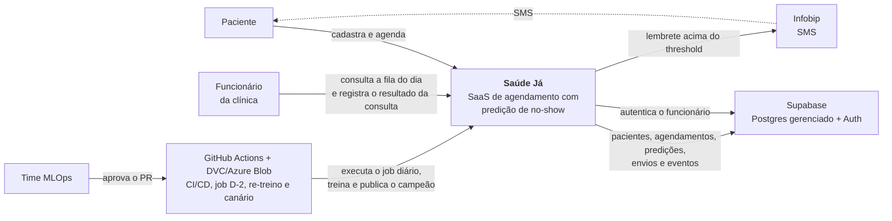
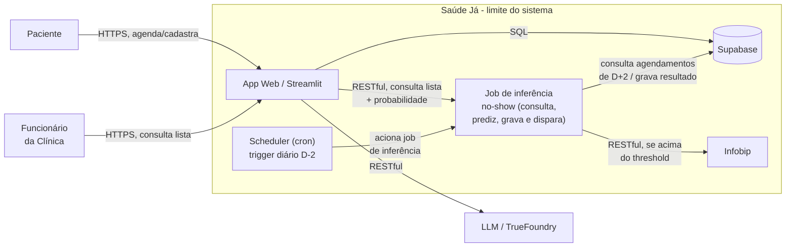
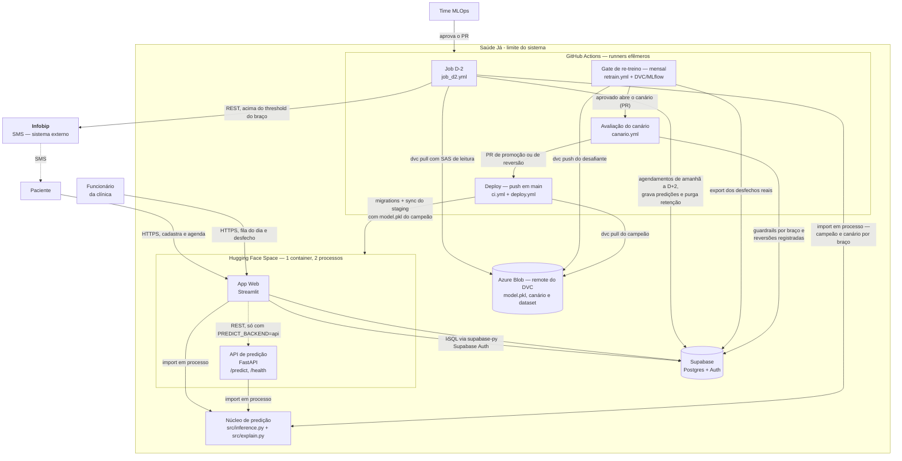

# Architecture Overview
This document serves as a critical, living template designed to equip agents with a rapid and comprehensive understanding of the codebase's architecture, enabling efficient navigation and effective contribution from day one. Update this document as the codebase evolves.

## 1. Project Structure

```
ai-factory-saudeja/
├── data/
│   ├── consultas-historicas.csv       # versionado via DVC (não versionado no git)
│   ├── consultas-historicas.csv.dvc   # metadados do DVC
│   ├── interim/                       # artefatos intermediários do pipeline (dados_validados.json, relatorio_dados.json, train_raw.pkl, test.pkl, mapa_especialidade.json, mlflow_run_id.txt)
│   ├── model.pkl                      # modelo treinado (saída do stage train)
│   ├── consultas-treino.csv           # semente + desfechos reais de produção (Passo 9.0, via DVC)
│   ├── champion_metrics.json          # métricas do modelo em produção (versionado em git, Passo 9.1)
│   ├── canario.json / canario/        # canário em observação, só enquanto ativo (Passo 10.7, ADR-009)
│   ├── canario_historico.json         # canários encerrados: promovidos e revertidos (Passo 10.7)
│   ├── AVISO-DADOS-SINTETICOS.md
│   └── AVISO-MODELO.md
├── docs/
│   ├── BRIEFING.md
│   ├── LGPD.md                        # base legal, retenção, direitos, riscos residuais (Passo 8)
│   ├── PLANO-IMPLEMENTACAO.md
│   ├── SLA.md
│   ├── SLO.md
│   ├── adr/                           # Architecture Decision Records
│   ├── diagrams/
│   │   └── SaudeJa-c1.png
│   ├── herdado/                       # documentação do protótipo herdado
│   ├── logs/
│   │   └── CHANGELOG.md
│   └── architecture.md                # este arquivo
├── infra/
│   ├── api/                            # dockerfile da API FastAPI isolada (Passo 3)
│   └── deploy/                         # dockerfile + entrypoint.sh combinados Streamlit+FastAPI (Passo 11, antecipado no Passo 4)
├── scripts/
│   ├── auditoria_lgpd.py              # varredura de PII em log (Passo 8, ferramenta local)
│   └── gerar_timestamp_sintetico.py   # geração de timestamp sintético (exploratório)
├── supabase/
│   ├── config.toml                    # config do Supabase CLI (supabase start, região local)
│   └── migrations/                    # schema versionado (pacientes/agendamentos/predicoes/mensagens_disparadas, Passo 5; índice de agendamentos.id_paciente, Passo 6; eventos_app, Passo 8.5)
├── src/
│   ├── config_projeto.py              # REPO_ROOT + carregar_params(): caminhos independentes do CWD
│   ├── logging_config.py              # log estruturado JSON + redação de PII (Passo 8)
│   ├── agenda_clinica.py              # grade de horários da clínica (cadastro do paciente, Passo 5)
│   ├── db/                            # client.py (supabase-py) + repositories.py (Passo 5)
│   ├── export_treino.py               # desfechos reais do Supabase -> consultas-treino.csv (Passo 9.0)
│   ├── contrato_features.py           # contrato de features: regra de negócio x domínio do treino (Passo 10.3)
│   ├── validate_data.py               # gate de dados do re-treino (stage 0, Passo 10.3)
│   ├── retrain_gate.py                # gate de promoção do re-treino mensal (Passo 9.1; piso e sanidade no 10.4)
│   ├── sanidade_modelo.py             # suíte de sanidade e casos limítrofes do modelo (Passo 10.4)
│   ├── campeao.py                     # "só o campeão vai para produção": sha + threshold (Passos 10.4/10.5)
│   ├── canario.py                     # canário do modelo: divisão da fila, guardrails e rollback (Passo 10.7)
│   ├── preprocess.py                  # feature engineering + split treino/teste (stage 1)
│   ├── train.py                       # SMOTE-NC + treino LightGBM, loga no MLflow (stage 2)
│   ├── validate.py                    # métricas no fold de teste isolado (stage 3)
│   ├── tune.py                        # GridSearchCV de hiperparâmetros (exploratório, fora do dvc.yaml)
│   ├── features.py
│   ├── inference.py                   # payload -> features -> predição, reusado por API/job (Passo 1)
│   ├── explain.py                     # explicabilidade SHAP + plug LLM inativo (Passo 2)
│   ├── api/                           # API FastAPI: schemas.py + main.py (Passo 3)
│   ├── ui/                            # interface Streamlit: app.py (telas) + logic.py (lógica testável) (Passo 4)
│   ├── jobs/                          # inferencia_diaria.py: job D-2 (Passo 6)
│   └── messaging/                     # client.py: interface + stub + InfobipClient (SMS real, Passo 7)
├── tests/                             # testes unitários e de integração do pipeline
├── .github/                          # workflows/: ci.yml, deploy.yml, job_d2.yml, retrain.yml, canario.yml, dependency-review.yml (Passo 10); dependabot.yml
├── .dvc/                              # configuração e cache do DVC (config versionado só com `core.remote`; URL/credencial fora do git)
├── dvc.yaml / dvc.lock                # definição e lock do pipeline DVC
├── params.yaml                        # hiperparâmetros do modelo
├── dockerfile / dockerfile.mlflow     # imagens de treino e do servidor MLflow
├── docker-compose.yml                 # orquestração local (mlflow-server)
├── requirements/                      # base.txt / train.txt / api.txt / ui.txt / dvc.txt / dev.txt
├── pytest.ini                         # marcador `integracao`
├── ruff.toml                          # configuração do lint (inclui as regras S, Passo 10.5)
├── mypy.ini                           # type-check estático em dois níveis (Passo 10.6)
├── .dockerignore / .gitattributes  # contexto de build enxuto; LF nos .sh mesmo no Windows
├── .env.example
└── README.md
```

## 2. High-Level System Diagram


###  Camada C1


```mermaid
flowchart LR
    Paciente["Paciente"]
    Funcionario["Funcionário<br/>da clínica"]
    MLOps["Time MLOps"]

    Sys["<b>Saúde Já</b><br/>SaaS de agendamento com<br/>predição de no-show"]

    Supabase["Supabase<br/>Postgres gerenciado + Auth"]
    Infobip["Infobip<br/>SMS"]
    Automacao["GitHub Actions + DVC/Azure Blob<br/>CI/CD, job D-2, re-treino e canário"]

    Paciente -->|"cadastra e agenda"| Sys
    Funcionario -->|"consulta a fila do dia<br/>e registra o resultado da consulta"| Sys
    Sys -->|"pacientes, agendamentos, predições,<br/>envios e eventos"| Supabase
    Sys -->|"autentica o funcionário"| Supabase
    Sys -->|"lembrete acima do threshold"| Infobip
    Infobip -.->|"SMS"| Paciente
    Automacao -->|"executa o job diário,<br/>treina e publica o campeão"| Sys
    MLOps -->|"aprova o PR"| Automacao
```

### 2.3. Camada C2 — original (Passo 6)


```mermaid
flowchart LR
    Paciente["Paciente"]
    Funcionario["Funcionário<br/>da Clínica"]
    LLM["LLM / TrueFoundry"]

    subgraph SaudeJa["Saúde Já - limite do sistema"]
        direction TB
        web["App Web / Streamlit"]
        DB[("Supabase")]
        Sched["Scheduler (cron)<br/>trigger diário D-2"]
        ML["Job de inferência<br/>no-show (consulta,<br/>prediz, grava e dispara)"]
        Aut["Infobip"]

        web -->|SQL| DB
        web -->|RESTful, consulta lista<br/>+ probabilidade| ML
        Sched -->|aciona job<br/>de inferência| ML
        ML -->|consulta agendamentos<br/>de D+2 / grava resultado| DB
        ML -->|RESTful, se acima<br/>do threshold| Aut
    end

    Paciente -->|HTTPS, agenda/cadastra| web
    Funcionario -->|HTTPS, consulta lista| web
    web -->|RESTful| LLM
```

O que diverge do código atual: a API FastAPI (3.2.1) não aparece, embora seja o container sobre o qual a seção 6 abre o ponto do Passo 11; a aresta `web --RESTful--> ML` não existe (a fila vem do Supabase por SQL, a predição é em processo, e o disparo manual da aba de dev chama `processar_dia` por import); o "Scheduler" genérico é o GitHub Actions, que é externo ao Space; não há nada do eixo de MLOps dos Passos 9 e 10 (gate, canário, campeão, DVC/Azure, MLflow); a Infobip está dentro do limite do sistema enquanto o TrueFoundry está fora; o LLM aparece como aresta sólida embora `ExplicadorLLMDesativado` nunca toque a rede; e a janela do job virou "amanhã até D+2" na revisão do Passo 10.

### 2.4. Camada C2 — revisado (2026-10-01)


```mermaid
flowchart TB
    Paciente["Paciente"]
    Funcionario["Funcionário<br/>da clínica"]
    MLOps["Time MLOps"]
    Infobip["<b>Infobip</b><br/>SMS — sistema externo"]

    subgraph SaudeJa["Saúde Já - limite do sistema"]
        direction TB

        subgraph Space["Hugging Face Space — 1 container, 2 processos"]
            direction LR
            web["App Web<br/>Streamlit"]
            api["API de predição<br/>FastAPI <br/>/predict, /health"]
        end

        nucleo["Núcleo de predição<br/>src/inference.py + src/explain.py<br/>"]

        subgraph Runner["GitHub Actions — runners efêmeros"]
            direction TB
            jobd2["Job D-2 <br/>job_d2.yml"]
            gate["Gate de re-treino — mensal<br/>retrain.yml + DVC/MLflow"]
            canario["Avaliação do canário <br/>canario.yml"]
            deploy["Deploy — push em main<br/>ci.yml + deploy.yml"]
        end

        DB[("Supabase<br/>Postgres + Auth")]
        Blob[("Azure Blob — remote do DVC<br/>model.pkl, canário e dataset")]
    end

    Paciente -->|"HTTPS, cadastra e agenda"| web
    Funcionario -->|"HTTPS, fila do dia e desfecho"| web
    web -->|"login e-mail/senha — Supabase Auth"| DB
    web -->|"SQL via supabase-py"| DB
    web -->|"import em processo"| nucleo
    web -.->|"REST, só com PREDICT_BACKEND=api"| api
    api -->|"import em processo"| nucleo

    jobd2 -->|"agendamentos de amanhã a D+2,<br/>grava predições e purga retenção"| DB
    jobd2 -->|"import em processo —<br/>campeão e canário por braço"| nucleo
    jobd2 -->|"REST, acima do threshold do braço"| Infobip
    Infobip -.->|"SMS"| Paciente
    jobd2 -->|"dvc pull com SAS de leitura"| Blob

    gate -->|"export dos desfechos reais"| DB
    gate -->|"dvc push do desafiante"| Blob
    gate -->|"aprovado abre o canário (PR)"| canario
    canario -->|"guardrails por braço e<br/>reversões registradas"| DB
    canario -->|"PR de promoção ou de reversão"| deploy
    deploy -->|"migrations + sync do staging<br/>com model.pkl do campeão"| Space
    deploy -->|"dvc pull do campeão"| Blob

    MLOps -->|"aprova o PR"| Runner
```

Leitura do diagrama: o que está dentro do limite do sistema é o que a SaúdeJá opera; Infobip e TrueFoundry são SaaS de terceiros. O **núcleo de predição** aparece fora dos dois agrupamentos de deploy de propósito — é o mesmo módulo importado pela UI, pela API e pelo job, que é o que [ADR-005](adr/adr-005-integracoes-implicitas.md) (b) decidiu e o que o teste de paridade entre backends protege. O canário não chega ao Space por construção (seção 6): ele vive no runner e no Azure Blob até ser promovido.

## 3. Core Components

### 3.1. Frontend

Name: App Web (Streamlit)

Description: Interface única para dois perfis de usuário — Paciente (cadastro/agendamento) e Funcionário da clínica (consulta da fila do dia com probabilidade de no-show, disparo manual do job de inferência em modo dev, consulta ao LLM sobre um paciente específico). Organizada em abas (`st.tabs`) que crescem incrementalmente conforme backend/banco/job ficam prontos (ver [`PLANO-IMPLEMENTACAO.md`](PLANO-IMPLEMENTACAO.md), Passo 4): "Testar predição" e "Explicabilidade" já funcionais desde o Passo 4; "Fila do dia" ligada no Passo 5 — e operável de fato desde 2026-09-28, quando a coluna "Paciente" deixou de mostrar o hash sha256 e passou a mostrar o nome ([ADR-007](adr/adr-007-nome-do-paciente.md)); "Dev: disparo manual" (visível só com `APP_ENV=dev`) ligada no Passo 6. Desde 2026-09-28 a visão do funcionário fica atrás de login com e-mail e senha no Supabase Auth ([ADR-008](adr/adr-008-login-da-equipe.md)); a do paciente segue aberta, porque é o autoagendamento.

Separação interna: `src/ui/app.py` é só apresentação; toda a lógica (montagem do payload, tradução de erro para mensagem, escolha do backend) vive em `src/ui/logic.py`, que não importa `streamlit` e é testado sem o runtime dele.

Como obtém a predição: **em processo por padrão** (import direto de `src/inference.py`/`src/explain.py`, conforme [ADR-005](adr/adr-005-integracoes-implicitas.md) (b) — a UI não depende de a API estar de pé nem paga round-trip HTTP dentro do próprio container). O backend REST contra a API (3.2.1) fica disponível em `PREDICT_BACKEND=api` como ferramenta de desenvolvimento/diagnóstico, com teste de paridade automatizado entre os dois caminhos. O LLM (5) é opcional, para consultas livres (Passo 13).

Technologies: Python, Streamlit, `httpx` (só no backend REST opcional)

Deployment: mesmo container do Hugging Face Space da API (ver 6), processo único, sem hospedagem separada.

### 3.2. Backend Services

#### 3.2.1. API de predição (FastAPI)

Name: API de predição de no-show

Description: Expõe `/predict` (recebe dados de um agendamento, retorna probabilidade de no-show + explicação SHAP) e `/health` (status + versão do modelo carregado). Carrega `data/model.pkl` uma vez no startup (`lifespan`), não por request, para atender o SLO de latência p95<2s. Serve tanto o Streamlit (chamado via REST para o formulário de teste/consulta) quanto integrações externas futuras ao ecossistema Saúde Já — ver decisão de acoplamento em [ADR-005](adr/adr-005-integracoes-implicitas.md).

Technologies: Python, FastAPI, LightGBM (via `src/inference.py`), SHAP

Deployment: Hugging Face Space (SDK Docker), junto com o Streamlit no mesmo container (ver 6).

#### 3.2.2. Job de inferência diária (D-2)

Name: Job de inferência no-show

Description: Executado diariamente às 08h17 de São Paulo (agendado externamente, ver ADR-005-a), busca no Supabase os agendamentos **de amanhã até D+2** ainda sem predição e sem lembrete — a janela de três dias recupera sozinha um dia em que o cron não rodou (revisão do Passo 10, 2026-09-29). Agendamento que não pode ser predito vai para quarentena sem interromper a fila, e o paciente recebe o lembrete mesmo assim, registrado como exceção (`enviado_sem_predicao`); todo lembrete enviado marca `agendamentos.lembrete_enviado`, que o re-treino usa contra o feedback loop. Datas e horas lidas do banco (UTC) são convertidas para o fuso da clínica antes de virar feature ou texto do SMS. Cada agendamento passa pelo **contrato de features** (`src/contrato_features.py`, Passo 10.3): fora da regra de negócio vai para a quarentena; fora do domínio do treino é predito e marcado (`predicoes.fora_do_dominio`). Roda a predição+explicação (import direto de `src/inference.py`, mesmo módulo usado pela API), grava o resultado na tabela `predicoes` e aciona o disparo de mensageria (5) quando a probabilidade ultrapassa o threshold de `params.yaml`. É também onde as duas políticas de retenção rodam (`eventos_app` e dados derivados, ver 4.1) -- o job já é diário, e agendador novo seria peça de infra a manter. Também exposto na aba "Dev: disparo manual" do Streamlit para acompanhamento sem depender de CLI/cron separados.

Technologies: Python (`src/jobs/inferencia_diaria.py`)

Deployment: roda **no runner do GitHub Actions** (`.github/workflows/job_d2.yml`, cron 08h17 + `workflow_dispatch`, `concurrency` obrigatório), não no Space — ver a emenda do Passo 10 no ADR-005. O caminho agendado (`main()`) acrescenta **pré-checagem** (modelo e threshold são os do campeão, banco alcançável) antes de qualquer SMS e **pós-checagem** (contabilidade da fila; quarentena de 100% falha o run) depois, com ping do Healthchecks.io em sucesso e `/fail` em falha. O modelo chega por `dvc pull data/model.pkl` com SAS só de leitura.

**Canário** (Passo 10.7, [ADR-009](adr/adr-009-canario-do-modelo.md)): com `data/canario.json` em `main`, o job também baixa `data/canario/model.pkl` e manda `canario.fracao` da fila (20%, sorteio estável por `id_paciente_externo`) para o modelo em observação. Cada predição grava o `model_version` e o threshold do braço que a decidiu. Antes de rotear, `canario.preparar_para_job` confere o canário e avalia os guardrails acumulados no banco: taxa de disparo e falta não avisada, por não-inferioridade contra o campeão no mesmo período. Na violação, grava `canarios_revertidos` e a fila vai 100% para o campeão já naquela execução (rollback automático). A quarentena por braço é conferida no fim de cada execução. Qualquer problema com o canário vira falha do run, nunca fila sem lembrete. A variável `CANARIO_DESLIGADO=true` do repositório o desliga sem PR. A aba "Dev: disparo manual" roda só com o campeão.

#### 3.2.3. Gate de re-treino mensal

Name: Gate de promoção de modelo

Description: Re-treina o pipeline DVC/MLflow contra os desfechos reais que a clínica registra na "Fila do dia" (`src/export_treino.py`, Passo 9.0), compara `recall_1`/`f1_1`/`roc_auc` contra o campeão (`data/champion_metrics.json`, versionado em git) e só promove se não houver **regressão relativa** além da tolerância por métrica de `params.yaml` (`gate.tolerancia`, justificada no [SLO §3.1](SLO.md)). Os alvos absolutos do SLO §3 não são critério de promoção — o modelo vigente já os viola, e se fossem nada seria promovido.

Além da regressão relativa, o Passo 10.4 acrescentou um **piso absoluto** de `roc_auc` (0,60, contra o efeito catraca), a **suíte de sanidade** do desafiante (`src/sanidade_modelo.py`: saída em [0, 1], não constante, SHAP aditivo, política do contrato nos casos limítrofes) e a **taxa de disparo projetada** no fold de teste, que só avisa. Antes do treino, o stage `validate_data` (Passo 10.3) barra o dataset por schema, regra de negócio e distribuição.

Quatro desfechos, distinguidos pelo código de saída porque o workflow age diferente em cada um: **0** promove (reescreve o campeão, `dvc push`, branch + PR automático, com o CI disparado no PR por `workflow_dispatch`), **1** bloqueia (regressão, piso ou sanidade — nada é publicado, o modelo anterior segue em produção por construção, não por convenção), **2** significa "nenhum re-treino efetivo" (dataset com o mesmo hash: nenhum desfecho novo registrado) e **3** "o pipeline falhou" (em geral o `validate_data` barrou o dataset). Os códigos 1, 2 e 3 falham o workflow; o comparativo campeão × desafiante vai para o `$GITHUB_STEP_SUMMARY` e para um artifact JSON, porque o MLflow daquele ciclo não sobrevive ao job. Alerta por Healthchecks.io/notificação nativa do Actions, **não** por `src/messaging` (5) — ver decisão 4 do Passo 9.

**Aprovar deixou de ser promover** (Passo 10.7, [ADR-009](adr/adr-009-canario-do-modelo.md)). Com campeão registrado e `canario.habilitado`, o código 0 abre o **canário** em vez de reescrever o campeão. O PR do `retrain.yml` leva `data/canario.json` e `data/canario/`, mas não o `dvc.lock`, que em `main` continua sendo o do campeão. O `canario.yml` (diário, 09h47 de SP) avalia os guardrails e abre o PR de promoção, que reescreve o campeão e restaura o lock do treino do canário, ou o de reversão, que remove o canário e o registra em `data/canario_historico.json` para o gate nunca mais aprová-lo. Dois códigos novos: **4** quando há canário em observação (o re-treino nem roda) e **1** também quando o desafiante já foi revertido num canário. A promoção direta continua no bootstrap e com o canário desligado.

Technologies: Python (`src/retrain_gate.py`, `src/canario.py`), DVC (remote em Azure Blob Storage), MLflow (efêmero via `docker-compose`, só durante o workflow)

Deployment: GitHub Actions (`.github/workflows/retrain.yml`, cron mensal + `workflow_dispatch`; `.github/workflows/canario.yml`, cron diário + `workflow_dispatch` para rollback manual), sem infraestrutura própria always-on.

## 4. Data Stores

### 4.1. Banco relacional principal

Name: Supabase (decisão vigente: [ADR-004](adr/adr-004-decisão-técnica.md), via SDK `supabase-py`)

Type: PostgreSQL gerenciado (SDK oficial, não camada Postgres genérica)

Purpose: armazena pacientes, agendamentos e resultado das predições/mensagens, com minimização de PII por design — `pacientes` guarda `id_paciente_externo` + atributos demográficos não identificáveis (`data_nascimento`, `sexo`) + **duas exceções deliberadas**, `telefone` e `nome_completo`. A guarda automatizada (`tests/test_coerencia_repo.py::test_migrations_sql_sem_coluna_proibida_de_pii`) segue proibindo **CPF e e-mail sem exceção**, e autoriza cada exceção por par (coluna, migration): a coluna só pode aparecer no arquivo que a introduziu.

`telefone` (migration `20260920020000_telefone_paciente.sql`, Passo 7): sem um contato de envio, o disparo de lembrete real via Infobip não tem para onde mandar mensagem. `nome_completo` (migration `20260928000000_nome_paciente.sql`, [ADR-007](adr/adr-007-nome-do-paciente.md)): a aba "Fila do dia" é operada por uma pessoa que precisa chamar o paciente pelo nome — a coluna "Paciente" mostrava o hash sha256 de 64 caracteres, o que não é operável. Os dois seguem o mesmo critério: dado **necessário** à finalidade, não acessório. O funcionário é preposto da controladora (§7) e já detém o prontuário, então nenhum destinatário novo entra em cena. Nullable e sem backfill — as linhas anteriores não têm nome a recuperar, e a UI mostra o início do hash em vez de fabricar uma pessoa.

**CPF segue nunca persistido**: `id_paciente_externo` é o hash sha256 dele, calculado em `src/ui/logic.py::_id_paciente_externo_de_cpf`. O ADR-007 fecha sete portas de saída para o nome (log, guarda de AST, `eventos_app`, export de treino, schema da API, select do job D-2 → Infobip, e o contexto do LLM), cada uma com teste travando. `idade` também não é mais coluna: guarda-se `data_nascimento`, e a idade usada como feature de inferência é sempre calculada sob demanda (`src/features.py::calcular_idade`), nunca persistida. Projeto na região São Paulo (`sa-east-1`) — dados permanecem no Brasil, sem transferência internacional (ver [ADR-005, emenda Passo 5](adr/adr-005-integracoes-implicitas.md)). RLS habilitado em todas as tabelas, sem policies: acesso só via `SUPABASE_SECRET_KEY` (chave secreta do backend, ignora RLS).

Key Schemas/Collections: `pacientes`, `agendamentos` (`lembrete_enviado` registra se o paciente foi lembrado — o re-treino precisa disso para não confundir "compareceu" com "compareceu porque foi lembrado"; desfecho só é gravado para consulta de hoje ou anterior; status inclui `no_show`, usado por `repositories.contar_no_shows_anteriores` para calcular `historico_noshow` automaticamente no próximo cadastro do mesmo paciente, em vez de ele autodeclarar), `predicoes` (inclui `explicacao_shap jsonb`, `explicacao_texto` nullable — plug do LLM, Passo 13 — e `fora_do_dominio` nullable, Passo 10.3: a predição foi feita sobre um agendamento com algum campo que o modelo não viu no treino; `null` = anterior à checagem), `mensagens_disparadas` (auditoria de envio, SLA §6), `eventos_app` (observabilidade de aplicação, Passo 8.5/[ADR-006](adr/adr-006-observabilidade.md) — latência por predição, execução do job e erros; **sem nenhuma coluna de PII**, e o `detalhe jsonb` é restringido por allowlist em `src/observabilidade.py`, já que o grep de nome de coluna não alcança dentro de um jsonb), `canarios_revertidos` (Passo 10.7: `model_version` de canário revertido, motivo e data — o estado que tira o canário da fila do job antes de o PR de reversão chegar a `main`, e a trilha de auditoria dos rollbacks; sem PII, sem purga). Schema versionado em `supabase/migrations/` (aplicado localmente via `supabase start`/`supabase db reset`, ver README).

Retenção (Passo 8, [`LGPD.md` §5](LGPD.md)): `eventos_app` 90 dias (teto do free tier, ADR-006) e `predicoes`/`mensagens_disparadas` 365 dias (`RETENCAO_DADOS_DERIVADOS_DIAS`, necessidade — Art. 6º, III), as duas purgas penduradas no job diário, sem agendador novo. `pacientes`/`agendamentos` **não** têm purga automática: são registro do atendimento, cuja exclusão é decisão do controlador (§7).

### 4.2. Tracking de experimentos de ML

Name: MLflow (backend sqlite + artifacts em volumes Docker locais)

Type: tracking server efêmero (sobe via `docker-compose` só durante treino/validação/gate de re-treino)

Purpose: rastreabilidade de hiperparâmetros/métricas/modelo de cada run de treino (ver README, seção "Pipeline de treino"). A fonte de verdade do "modelo campeão" para produção é `data/champion_metrics.json` (versionado em git), não uma run do MLflow — que não sobrevive entre execuções do workflow mensal (ver Passo 9). O arquivo foi semeado no Passo 9.1 com as métricas **medidas** da run que gerou o `model.pkl` vigente (`recall_1` 0.429, `f1_1` 0.419, `roc_auc` 0.643, threshold 0.6), e a partir daí só é reescrito pelo gate ao promover.

## 5. External Integrations / APIs

Service Name: Infobip

Purpose: disparo de lembrete/confirmação via SMS para pacientes classificados com alta probabilidade de no-show pelo job diário (D-2).

Integration Method: REST API, atrás de uma interface própria (`src/messaging/client.py`) com `StubMessagingClient` (default, sem custo/rede, dev/test) e `InfobipClient` (real, `MESSAGING_PROVIDER=infobip`). Canal SMS (`POST /sms/2/text/advanced`), não WhatsApp Business — WhatsApp exige sender/template pré-aprovados pela Meta, inviável de configurar no sandbox/prazo da disciplina (confirmado na prática: `GET /whatsapp/1/senders` da conta trial não tem nenhum sender provisionado). Autenticação por API Key própria da Infobip (`Authorization: App <chave>`, não Bearer/OAuth). Validado ponta a ponta contra a conta trial real (Passo 7): primeira tentativa rejeitada por `EC_ACCOUNT_NOT_PROVISIONED_FOR_CHANNEL` (canal SMS não provisionado na conta, não bug de formatação), reenviada após provisionamento manual no painel do Infobip e confirmada como `DELIVERED_TO_HANDSET`.

Service Name: TrueFoundry (LLM gateway)

Purpose: opcional (Passo 13, não exigido pelo SLA/SLO) — permite ao funcionário consultar um paciente específico em linguagem natural, e futuramente traduzir as contribuições SHAP em uma frase explicativa (plug inativo já reservado no Passo 2).

Integration Method: REST API, mesmo padrão interface+stub usado para a Infobip.

Service Name: MLflow

Purpose: ver 4.2.

Integration Method: API Python do MLflow, servidor local via Docker Compose.

## 6. Deployment & Infrastructure

Cloud Provider: Hugging Face Space (SDK Docker) para a aplicação; Supabase (gerenciado) para o banco.

Key Services Used: Hugging Face Space (Streamlit + FastAPI no mesmo container, modelo `data/model.pkl` versionado via DVC e empacotado direto na imagem — não depende de MLflow ao vivo em produção, ver Passo 9); Azure Blob Storage como remote do DVC (Passo 9.1 — dataset de treino e `model.pkl`, os dois fora do git; é o que torna o modelo alcançável pelo Actions e pelo deploy, o que o remote anterior `/tmp/dvc-remote` não era); GitHub Actions (CI de PR, deploy por sync ao HF Hub via `huggingface/hub-sync` — o antigo `huggingface-sync-action` —, cron mensal do gate de re-treino, cron diário do job D-2 — ver [ADR-005-a](adr/adr-005-integracoes-implicitas.md)).

A imagem combinada vive em `infra/deploy/` (`dockerfile` + `entrypoint.sh`) e já existe desde o Passo 4 — antecipada do Passo 11 para o conjunto poder ser exercitado localmente como ele vai rodar em produção (`docker compose up -d app`: UI em 7860, API em 8000). Um container, dois processos, sem supervisord: `entrypoint.sh` sobe os dois, derruba o container inteiro se qualquer um deles sair (`wait -n`) e encerra ambos em SIGTERM. O `model.pkl` é empacotado na imagem (ao contrário de `infra/api/dockerfile`, que o monta por volume em dev) porque não há DVC nem acesso ao remote no runtime do Space.

**Ponto em aberto para o Passo 11**: o HF Space (SDK Docker) publica **uma única porta** (`app_port`, default 7860). Com UI e API em portas diferentes, só uma fica acessível de fora — a UI. Como a UI chama o modelo em processo (ADR-005 b), o produto funciona; o que fica sem endereço público é o papel da API como porta de entrada para integrações externas ao Saúde Já (diagrama C2). Decidir no Passo 11 entre: expor só a UI e adiar a API pública, colocar um proxy reverso na frente dos dois, ou publicar a API e servir a UI por outro caminho. Localmente as duas portas são publicadas e o dilema não aparece.

CI/CD Pipeline (Passo 10): GitHub Actions, com gates por camada do mais barato ao mais caro.

| Workflow | Gatilhos | O que faz |
|---|---|---|
| `ci.yml` | PR para `dev`/`main`, `workflow_dispatch`, `workflow_call` | `ruff` (com regras S) → `mypy` → `dvc pull data/model.pkl` (SAS de leitura) → `pytest` (contrato, `validate_data`, skew, suíte de sanidade do modelo). Em paralelo, build da imagem de deploy **a partir do staging de lista fechada** (`scripts/montar_staging_space.py`, o mesmo contexto que o Space builda), smoke como uid 1000 (`scripts/smoke_deploy.py local`: `/_stcore/health`, `/health` e a `model_version` servida igual à do `model.pkl` empacotado) e varredura de PII no log do container. Integração (Supabase local + pipeline no container) obrigatória em PR que toque `src/jobs`, `src/db`, `src/export_treino.py` ou `supabase/`, e sempre em `main` |
| `deploy.yml` | push em `main` (sem `docs/**`), `workflow_dispatch` | `ci` reutilizado → `dvc pull data/model.pkl` → guarda do campeão (`src/campeao.py`: sha e threshold) → **staging com lista fechada** (`scripts/montar_staging_space.py`) → `supabase db push` → `huggingface/hub-sync` do staging → espera o Space buildar no commit novo e responder na URL pública (`scripts/smoke_deploy.py space`). `environment: production`, `concurrency` sem cancelamento |
| `job_d2.yml` | cron 08h17 SP, `workflow_dispatch` | job D-2 no runner (3.2.2) |
| `retrain.yml` | cron dia 1 às 03h17 SP, `workflow_dispatch` | gate de re-treino (3.2.3); aprovado com campeão existente abre o canário |
| `canario.yml` | cron 09h47 SP, `workflow_dispatch` (`acao=reverter` + motivo) | avalia o canário e abre o PR de promoção ou de reversão (3.2.3, [ADR-009](adr/adr-009-canario-do-modelo.md)) |
| `dependency-review.yml` | PR | template do GitHub |

O CI é o primeiro job do deploy (`workflow_call`): o SHA testado é o deployado, e falha no CI deixa o deploy pulado por construção. A migration vem **antes** do sync: o Space rebuilda sozinho ao receber os arquivos, então não há janela depois dele em que dê para migrar com segurança; nada na imagem do Space aplica migration. Ver Passo 10.1, que também fixa a regra de compatibilidade (migration aditiva pode ir junto do código que a exige; destrutiva/restritiva, nunca). O sync sobe um **diretório de staging com lista fechada** (Dockerfile, README com o front-matter do Space, `requirements/{base,api,ui}.txt`, `src/`, `params.yaml`, `entrypoint.sh`, `data/model.pkl`), nunca o checkout: a action faz `hf upload` sem git e não respeita os `.gitignore` aninhados — subiria a URL do remote do DVC e o dataset de treino para um Space público. A lista mora num script só, usado pelo CI e pelo deploy, e `tests/test_deploy.py` confere que toda origem de `COPY` do `infra/deploy/dockerfile` está nela e que cada workflow (e a imagem do Space) importa o que executa só com os `requirements/` que instala. Actions de terceiros fixadas por SHA, mantidas pelo Dependabot. O canário (Passo 10.7) fica fora do Space por construção: não está na lista do staging, e os paths dele estão no `paths-ignore` do deploy. Abrir ou reverter um canário não rebuilda nada; a promoção muda `champion_metrics.json` e `dvc.lock` e deploya como qualquer troca de campeão. No PR do canário, o `ci.yml` baixa o modelo dele e roda `canario.py verificar --sanidade`.

Monitoring & Logging: MLflow para métricas de ML (4.2); `eventos_app` no Supabase como fonte de verdade das métricas de aplicação (4.1/ADR-006); logging estruturado JSON com redação de PII (`src/logging_config.py`, Passo 8) para a aplicação. Sem Langfuse/APM dedicado no núcleo — reservado para tracing do LLM opcional (Passo 13).

O filtro de redação é instalado por `configurar_logging()`, chamado uma vez em cada entrypoint (`lifespan` da API, `main()` do job, topo de `src/ui/app.py`), e mora no **handler** — aplicado a todos os handlers já presentes no processo, não só ao da raiz. Isso é o que faz a garantia valer para o log de terceiros (`uvicorn` põe `propagate=False` nos loggers dele; o Streamlit faz algo equivalente), que é o único que existe em volume em produção. Detalhe da decisão em [`LGPD.md` §8](LGPD.md).

## 7. Security Considerations

Authentication: chaves de serviço do Supabase (`SUPABASE_URL`/`SUPABASE_SECRET_KEY`), token do HF Space (`HF_TOKEN`, fine-grained, só no environment `production`) e credencial do remote DVC como secrets, nunca versionados — com duas credenciais do DVC desde o Passo 10: a de escrita (`AZURE_STORAGE_CONNECTION_STRING`) só no re-treino, o único que faz `dvc push`, e uma **SAS só de leitura** (`AZURE_STORAGE_CONNECTION_STRING_LEITURA`) no CI, no deploy e no job D-2, porque o CI roda código de PR (`.env.example` documenta as variáveis, não os valores). No caso do DVC, **a própria URL do remote** (`DVC_REMOTE_URL`) também fica fora do git: `.dvc/config` é versionado e guarda só `[core] remote = azure`, porque a URL carrega o nome do container onde o dataset de treino está armazenado.

Data residency: o banco de produção fica em `sa-east-1` (São Paulo), mas o remote do DVC fica em **Chile Central** — ou seja, há transferência internacional de um dataset derivado de dados de saúde. O que limita a exposição é o conteúdo, não a região: o dataset exportado é pseudonimizado (`id_paciente` é hash sha256 de CPF) e nunca inclui telefone, nome ou CPF. Registrado como emenda do Passo 9.1 no [ADR-005](adr/adr-005-integracoes-implicitas.md); base legal fechada no Passo 8 em [`LGPD.md` §4](LGPD.md) (Art. 33, II, "d" — cláusulas contratuais padrão do DPA do provedor), com o risco residual declarado ali e destinado ao slide de risco do Passo 12. A formulação correta para o pitch: "os dados não saem do Brasil" é verdade para o banco de produção e **falso** para o artefato de treino.

Papéis LGPD: a **clínica-cliente é a controladora** (decide finalidade, tem a relação com o paciente, responde pelo prontuário) e a **SaúdeJá é operadora** (trata em nome dela, nos limites do contrato do SaaS) — ver [`LGPD.md` §1](LGPD.md). Isso é o que determina de quem é a base legal, por onde chega um pedido do Art. 18 e, concretamente, o que a retenção automática pode apagar: só dado **derivado** (`predicoes`, `mensagens_disparadas`, 365 dias, purga no job diário). `pacientes`/`agendamentos` nunca são purgados por iniciativa nossa.

Authorization: a visão do funcionário exige e-mail e senha no **Supabase Auth** do mesmo projeto ([ADR-008](adr/adr-008-login-da-equipe.md)). O cadastro aberto fica desligado e as contas são criadas pelo administrador (`scripts/criar_funcionario.py`). O login só **prova identidade**: os dados continuam sendo lidos com a chave secreta do backend, o RLS segue sem policies e o token do Supabase é revogado logo após a verificação, sem ser guardado. A tentativa de login usa um client descartável, nunca o singleton de `src/db/client.py`, porque o `supabase-py` troca o `Authorization` do client pelo JWT do usuário depois do sign-in e isso esvaziaria as consultas do backend para todos os navegadores. A sessão fica em `st.session_state` (memória do servidor, sem cookie) e expira depois de 30 minutos sem interação. O que continua **sem** controle: não há RBAC (toda conta vê as mesmas abas), a visão do paciente é aberta e a API FastAPI não tem autenticação (`/predict` não lê o banco). Riscos residuais em [`LGPD.md` §9](LGPD.md).

Data Encryption: TLS em trânsito (HTTPS do HF Space, conexão do `supabase-py` ao Postgres gerenciado); repouso sob responsabilidade do Supabase gerenciado.

Key Security Tools/Practices: minimização de PII por design no schema (4.1), pseudonimização do CPF antes da persistência, RLS sem policies em todas as tabelas, redação de PII em log (`src/logging_config.py`) mais a guarda estática sobre a AST de `src/` (`tests/test_coerencia_repo.py::test_nenhuma_chamada_de_log_em_src_referencia_campo_de_pii`), e `scripts/auditoria_lgpd.py` como varredura de log — rebaixada de evidência principal a ferramenta de verificação local, porque o log do Space é efêmero (ADR-006). `ErroEnvioInfobip` deixou de embutir o corpo da resposta da Infobip, que ecoava o telefone do destinatário. Base legal, retenção, direitos do titular e riscos residuais em [`docs/LGPD.md`](LGPD.md) (Passo 8).

## 8. Development & Testing Environment

Local Setup Instructions: ver [`README.md`](../README.md), seção "Como usar o repositório" (Docker + DVC + MLflow local via `docker compose up -d mlflow-server` e `dvc exp run`/`dvc repro`).

Testing Frameworks: Pytest (`pytest.ini` define o marcador `integracao` para testes que sobem serviços reais efêmeros — MLflow com sqlite temporário, futuramente Supabase CLI local no Passo 5 — em vez de mocks pesados).

A interface é testada em duas camadas: `tests/test_ui_logic.py` (lógica pura, sem runtime do Streamlit, incluindo o teste de paridade entre os backends de predição) e `tests/test_ui_smoke.py` (`streamlit.testing.v1.AppTest`, que roda o script de verdade sem browser — abas presentes, gating de `APP_ENV`, caminho feliz do formulário).

Code Quality Tools: `ruff`, configurado em [`ruff.toml`](../ruff.toml) (line-length 100, target `py310`, regras `E,W,F,I,UP,B,SIM,C4,RUF` e, desde o Passo 10.5, `S` — flake8-bandit, no lugar de um workflow Bandit separado), e `mypy` (Passo 10.6), configurado em [`mypy.ini`](../mypy.ini), ambos pinados em `requirements/dev.txt`. Rodam com `ruff check src tests scripts` e `mypy src scripts`; o CI usa os mesmos comandos, sem flags extras, para que local e CI não possam divergir.

O `mypy` tem dois níveis: `disallow_untyped_defs` na **fronteira escalar** (contrato, configuração, agenda, banco, export, job, mensageria, observabilidade, schemas da API, gate, sanidade, campeão) — datas, identificadores, telefone, threshold, retorno de repositório — e baseline no resto, cujas assinaturas são essencialmente `DataFrame -> DataFrame`. A divisão de trabalho é deliberada: **mypy na fronteira escalar, contrato de features (runtime) na fronteira tabular**; `pandas-stubs` fica de fora. E o type-check **não** protege contra fuso horário: `datetime` naive e com fuso são o mesmo tipo — quem protege é `tests/test_skew_features.py`.

Nota de convenção — **datas sempre no fuso da clínica**: `config_projeto.fuso_da_clinica()`/`hoje_na_clinica()` (`TIMEZONE_CLINICA`, default `America/Sao_Paulo`) são a fonte única para UI, repositórios e o job D-2. Nem `date.today()` nem UTC servem: o container roda em UTC, então depois das 21h em São Paulo a "fila do dia" e a janela D-2 cairiam no dia civil errado, e horários de `timestamptz` apareceriam 3h deslocados. Gravação leva o fuso explícito; leitura faz `astimezone`.

Nota de convenção: os módulos de `src/` são importados "soltos" (sem prefixo de pacote) — `src/config_projeto.py` centraliza `REPO_ROOT` e `carregar_params()`, de modo que `params.yaml` e os caminhos default de `data/` sejam resolvidos a partir da raiz do repositório e não do CWD do processo. Isso mantém API, scripts e containers funcionando independentemente de onde forem iniciados; variáveis de ambiente (usadas pelo `dvc.yaml` para apontar para dentro do bind mount) continuam tendo precedência.

## 9. Future Considerations / Roadmap

**Debt conhecido — gap de recall**: o recall da classe positiva (no-show) do modelo **vigente** é 0.429, com `f1_1` 0.419 e `roc_auc` 0.643 (medidos no threshold 0.6, registrados em `data/champion_metrics.json` desde o Passo 9.1), abaixo do alvo do SLO (≥0.75). O 0.522 que este documento citava vinha do [ADR-003](adr/adr-003-SMOTE-NC.md), medido em outra configuração (antes de `features.temporais=true` e em outro threshold) — não era o número do modelo em produção. Não é um bug de implementação — é limite do dataset sintético pequeno (380 linhas). Não será resolvido agora; o [`PLANO-IMPLEMENTACAO.md`](PLANO-IMPLEMENTACAO.md) cria checkpoints explícitos para revisitar a questão (Passo 6, com dados fluindo pelo job real; Passo 12, fechamento obrigatório antes do pitch — threshold recalibrado ou gap aceito e documentado).

Outros itens de roadmap: RBAC e autorização no banco (policies de RLS lidas com o JWT do funcionário, em vez da chave secreta; hoje o login só prova identidade, [ADR-008](adr/adr-008-login-da-equipe.md)); autenticação da API FastAPI quando ela ganhar um consumidor externo real; SSO via `st.login` (OIDC) se a clínica usar Google Workspace ou Microsoft 365; LLM/TrueFoundry (Passo 13, opcional, fora do SLA/SLO); Langfuse para tracing do LLM quando este for ativado.

## 10. Project Identification

Project Name: SaudeJá — Classificador de no-show em agendamentos médicos

Repository URL: (repositório local/privado da disciplina AI Factory: Build, Deploy and Showcase — sem URL pública no momento)

Primary Contact/Team: Vanessa Hoysan Lin

Date of Last Update: 2026-10-01 (Passo 10.7 — canário do modelo com rollback automático, ADR-009)

## 11. Glossary / Acronyms

No-show: ausência do paciente a uma consulta agendada sem cancelamento prévio.

D-2 / D+2: dois dias antes da data da consulta — momento em que o job de inferência roda a predição para os agendamentos daquele intervalo.

SMOTE-NC: técnica de balanceamento de classes (SMOTE) adaptada para lidar com variáveis categóricas e numéricas mistas (Nominal-Continuous).

SLA/SLO: Service Level Agreement / Service Level Objective — ver [`docs/SLA.md`](SLA.md) e [`docs/SLO.md`](SLO.md).

ADR: Architecture Decision Record — ver [`docs/adr/`](adr/).

Canário: modelo aprovado pelo gate que decide só uma fração da fila do job D-2, comparado ao campeão no mesmo período até ser promovido ou revertido — ver [ADR-009](adr/adr-009-canario-do-modelo.md).

Campeão: o modelo em produção, registrado em `data/champion_metrics.json`.

LGPD: Lei Geral de Proteção de Dados (Brasil) — ver [`docs/LGPD.md`](LGPD.md).

Controlador / Operador: quem decide a finalidade do tratamento (a clínica-cliente) e quem trata em nome dele (a SaúdeJá) — Art. 5º, VI e VII da LGPD. Ver [`LGPD.md` §1](LGPD.md).
